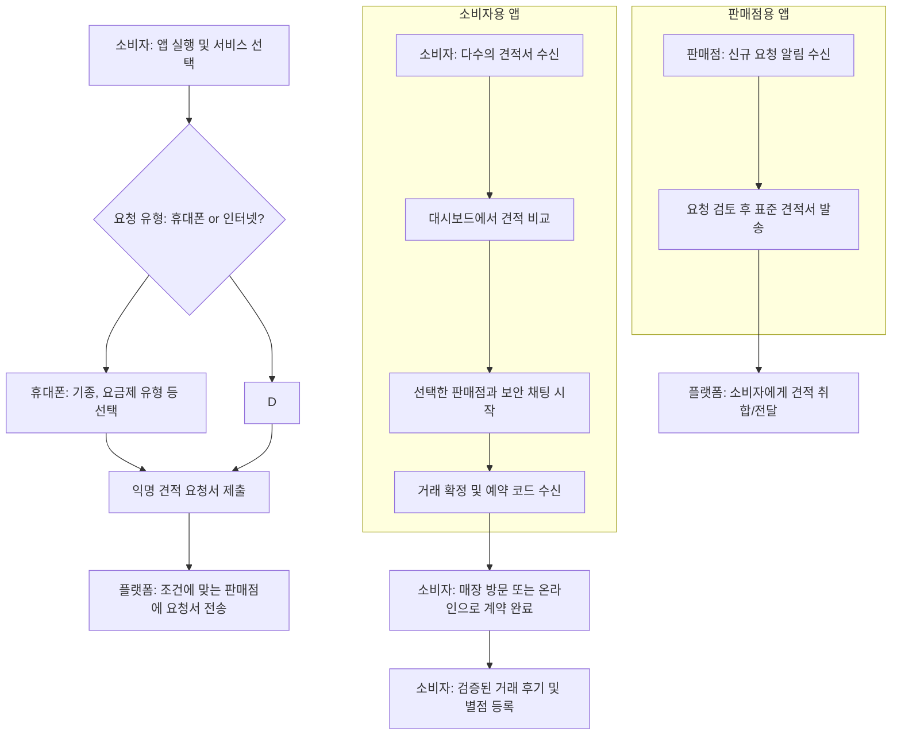

# T-Bridge 서비스 기획서

## 1. 기획 의도 및 목표

### 1.1. 기획 배경: 변화의 격랑에 선 대한민국 통신 시장

대한민국 통신 시장은 성숙기를 넘어 포화 상태에 이르렀습니다. SK텔레콤, KT, LG유플러스라는 3대 이동통신사가 시장을 과점하는 구조는 오랫동안 유지되어 왔으나 1, 최근 시장의 근본적인 지각 변동이 감지되고 있습니다. 이러한 변화의 중심에는 소비자의 주도권 강화라는 거대한 흐름이 자리 잡고 있습니다.

과거 통신 시장은 통신사가 단말기 유통과 요금제 설계를 모두 장악하는 '공급자 중심'의 구조였습니다. 소비자는 통신사가 제공하는 제한된 선택지 내에서 구매를 결정해야 했습니다. 그러나 최근 몇 년 사이, 이러한 패러다임은 빠르게 해체되고 있습니다. '자급제폰(공기계)' 구매 비중의 폭발적인 증가는 이러한 변화를 가장 명확하게 보여주는 지표입니다. 2023년 기준, 전체 이동통신 시장에서 자급제 단말 이용률은 25.9%를 넘어섰으며, 일부 조사에서는 33.7%에 달하는 것으로 나타났습니다.3 이는 소비자들이 더 이상 단말기 구매를 특정 통신사의 2년 약정에 묶어두지 않고, '단말기 선택'과 '요금제 선택'을 완전히 별개의 의사결정 과정으로 분리하고 있음을 의미합니다.

이와 동시에 '알뜰폰(MVNO)' 시장의 급성장은 소비자들이 더 이상 통신 3사의 브랜드 파워나 멤버십 혜택에 얽매이지 않고, 합리적인 가격과 유연한 약정 조건을 최우선 가치로 여기기 시작했음을 증명합니다. 알뜰폰 시장 점유율은 이미 10%를 훌쩍 넘어 20%를 향해 나아가고 있으며 5, 이는 가격에 민감하고 능동적으로 정보를 탐색하는 소비자층이 두터워지고 있음을 시사합니다.

이러한 시장의 변화는 공급자 중심에서 '소비자 중심'으로 권력의 축이 이동하고 있음을 보여줍니다. 소비자는 이제 스스로 단말기를 선택하고, 그 후에 자신에게 가장 유리한 요금제를 찾아 나서는 '분리된 의사결정'을 내립니다. 바로 이 '요금제 결정의 순간(moment of decision)'이야말로 T-Bridge가 포착해야 할 핵심적인 시장 기회입니다. T-Bridge는 이 결정의 순간에 개입하여 소비자에게 가장 필요한 정보와 선택지를 제공하는 역할을 수행할 것입니다.

### 1.2. 핵심 기회: 단통법 폐지, 규제에서 혼돈으로

2014년부터 시행된 '이동통신단말장치 유통구조 개선에 관한 법률(단통법)'은 지원금 상한제를 통해 이용자 간 차별을 없앤다는 명분을 가졌지만, 실제로는 시장의 가격 경쟁을 억제하고 전반적인 구매 비용을 상승시키는 결과를 낳았습니다.6 정부가 이 단통법의 폐지를 공식화하면서 8, 통신 시장은 규제의 시대에서 다시 한번 치열한 경쟁의 시대로 회귀할 준비를 하고 있습니다.

단통법 폐지는 통신사와 유통점 간의 무한한 '지원금 전쟁'을 예고합니다. 이는 표면적으로 소비자에게 이득처럼 보일 수 있지만, 그 이면에는 극심한 정보 비대칭성과 혼란이 도사리고 있습니다. 지원금 규모는 특정 고가 요금제, 불필요한 부가서비스 의무 사용 기간, 복잡한 결합 상품 가입 등 다양한 조건과 연동되어 극도로 복잡하고 불투명한 형태로 제공될 것입니다.10 결국 과거와 같이 '아는 사람만 저렴하게 구매하고, 모르는 사람은 여전히 비싸게 사는' 소위 '호갱' 양산의 시대가 재현될 가능성이 매우 높습니다.6

이러한 시장 환경의 변화는 T-Bridge의 가치 제안을 근본적으로 바꾸어 놓습니다. 단통법 체제 하에서 가격 비교 플랫폼은 단순히 '더 편리한 서비스(Nice-to-have)'에 가까웠다면, 단통법 폐지 이후의 혼란스러운 시장에서는 '필수적인 생존 도구(Must-have)'로 그 위상이 격상됩니다. T-Bridge는 단순히 최저가를 찾아주는 도구를 넘어, 혼돈의 시장을 해석하는 '네비게이터'이자, 소비자를 기만적인 상술로부터 보호하는 '방패' 역할을 수행해야 합니다. 복잡한 판매 조건을 표준화된 지표로 명쾌하게 번역하고, 신뢰할 수 있는 판매점만을 연결함으로써 소비자의 정보 탐색 비용과 심리적 불안감을 획기적으로 낮추는 것, 이것이 T-Bridge가 시장에 제공할 독보적인 가치이자 가장 강력한 존재 이유입니다.

### 1.3. 서비스 미션 및 목표

#### 서비스 미션

투명하고 효율적이며 신뢰할 수 있는 디지털 다리를 제공함으로써, 모든 대한민국 소비자가 자신의 통신 서비스를 정보에 기반하여 자신감 있게 선택하고 비용을 절감할 수 있도록 돕는다.

#### 전략적 목표

- **1단계 (서비스 출시 후 1년):** 수도권 지역을 중심으로 10만 명 이상의 활성 사용자와 500개 이상의 검증된 파트너 판매점을 확보한다. 단통법 폐지 이후 가장 신뢰받는 휴대폰 요금제 비교 플랫폼으로 브랜드 인지도를 구축한다.
    
- **2단계 (서비스 출시 후 3년):** 사용자 수 및 거래액 기준, 대한민국 1위 O2O 통신 중개 플랫폼으로 도약한다. 서비스 범위를 인터넷/IPTV 결합 상품까지 확장하고 전국적인 판매점 네트워크를 완성한다.
    
- **3단계 (서비스 출시 후 5년):** 중고 단말기 거래, 수리 서비스, IoT 솔루션 등을 통합하여 '연결(Connectivity)'과 관련된 모든 것을 해결하는 종합 라이프스타일 플랫폼으로 진화한다.
    

## 2. 주요 타겟 사용자

T-Bridge는 양면 시장(Two-sided Market) 플랫폼으로서, 소비자와 판매점이라는 두 개의 명확한 사용자 그룹을 대상으로 합니다. 각 그룹의 특성과 니즈를 깊이 이해하는 것이 성공의 핵심입니다.

### 2.1. 소비자 페르소나

#### 페르소나 1: 실속파 절약가, 이지혜 (32세, IT 기업 마케터)

- **특징:** 자급제 아이폰을 사용하며, 3~4만원대의 알뜰폰 LTE 요금제를 이용 중입니다. 새로운 기술과 서비스 사용에 익숙하며, 불필요한 시간 낭비를 극도로 싫어합니다. 통신사의 멤버십 혜택보다는 실질적인 요금 할인을 중요하게 생각합니다.
    
- **목표:** 최소한의 노력으로, 현재 자신의 데이터 사용량에 가장 적합하면서도 가장 저렴한 요금제를 찾고 싶어 합니다. 복잡한 조건 없이 명시된 가격 그대로 계약하기를 원합니다.
    
- **T-Bridge의 역할:** 이지혜 씨에게 T-Bridge는 '효율성 극대화 도구'입니다. 여러 알뜰폰 통신사와 판매점의 요금제를 한눈에 비교하고, 숨겨진 조건 없이 '실질 할부원금'과 월 납부액을 명확히 제시함으로써 그녀의 시간과 노력을 아껴줍니다.4
    

#### 페르소나 2: 정보 취약자, 박준서 (55세, 개인 식당 운영)

- **특징:** 통신 용어나 요금제 구조를 매우 복잡하고 어렵게 느낍니다. 과거 휴대폰 매장에서 불쾌한 경험을 한 적이 있어, 판매원의 말을 신뢰하지 않으며 '호갱'이 될 것을 두려워합니다.12 이 때문에 불편함을 감수하고 기존 통신사를 계속 이용하는 경향이 있습니다.
    
- **목표:** 사기당할 걱정 없이, 누군가 알아서 가장 합리적인 선택지를 명확하고 쉽게 설명해주기를 바랍니다. 안전하고 신뢰할 수 있는 구매 경험을 원합니다.
    
- **T-Bridge의 역할:** 박준서 씨에게 T-Bridge는 '신뢰의 보증수표'입니다. 모든 판매점을 사전에 검증하고, 실제 구매자만 남길 수 있는 후기 시스템을 운영하며, 모든 상담 내용을 앱 내 채팅에 기록으로 남겨 분쟁의 소지를 없앱니다. 이는 그에게 심리적 안정감을 제공하고, 자신감을 가지고 구매 결정을 내릴 수 있도록 돕습니다.
    

#### 페르소나 3: 성지 탐방가, 김민준 (24세, 대학생)

- **특징:** 온라인 커뮤니티(네이버 카페 등)를 통해 '휴대폰 성지' 정보를 수집하는 데 능숙합니다.15 '공시지원금', '선택약정', '부가서비스 유지 기간' 등 전문 용어를 완벽하게 이해하고 있으며, 큰 폭의 할인을 받을 수 있다면 다소 까다로운 조건도 기꺼이 감수합니다.
    
- **목표:** 시장에 나온 '성지' 매물 중 가장 할인율이 높은 '좌표(위치 정보)'를 빠르고 정확하게 찾아내고자 합니다. 커뮤니티의 암호 같은 '시세표'를 해독하는 데 시간을 쏟고 있습니다.10
    
- **T-Bridge의 역할:** 김민준 씨에게 T-Bridge는 '고급 정보 집약 플랫폼'입니다. 파편화된 커뮤니티 정보를 한곳에 모으고, 'T-Bridge 인증 성지' 제도를 통해 신뢰도를 더하며, 암호 같은 시세표를 표준화된 포맷으로 제공하여 정보 탐색의 효율을 극대화합니다. 특정 모델에 대한 '성지 특가 알림' 기능은 그의 '사냥' 경험을 더욱 즐겁게 만들어 줄 것입니다.
    

### 2.2. 판매점 페르소나

#### 페르소나 1: 골목상권 사장님

- **특징:** 정직하게 매장을 운영하지만, 대형 유통망이나 공격적인 온라인 대리점의 마케팅 공세에 밀려 고객 유치에 어려움을 겪습니다.
    
- **목표:** 적은 비용으로 매장 주변의 실구매 의사가 있는 고객들에게 자신의 매장을 알리고, 정직한 가격과 서비스로 승부할 수 있는 채널을 원합니다.
    
- **T-Bridge의 역할:** 이들에게 T-Bridge는 '공정한 경쟁의 장'입니다. 거대 자본의 광고 물량 공세가 아닌, 오직 가격 경쟁력과 고객 만족도 평가만으로 고객과 만날 수 있는 기회를 제공합니다.
    

#### 페르소나 2: 성지 매장 운영자

- **특징:** 업계 최고의 가격 경쟁력을 무기로 박리다매 전략을 구사합니다. 하지만 과도한 관심과 단속을 피하기 위해 폐쇄적인 온라인 커뮤니티를 통해서만 영업 활동을 합니다.
    
- **목표:** 신분 노출의 위험 없이, 구매 의사가 확실한 '진성 고객'들에게 더 넓게 접근하고 싶어 합니다. 불필요한 문의는 줄이고 실제 계약으로 이어질 확률이 높은 고객들과 소통하기를 원합니다.
    
- **T-Bridge의 역할:** 이들에게 T-Bridge는 '안전한 확성기'입니다. 익명성이 보장되는 플랫폼을 통해 더 많은 잠재 고객에게 자신의 '특가'를 알릴 수 있습니다. 'T-Bridge 인증 성지' 타이틀은 고객에게 신뢰를 주면서도, 플랫폼이 1차적인 필터 역할을 해주어 영업 효율을 높여줍니다.
    

## 3. 주요 기능 및 공통 기능

T-Bridge는 소비자와 판매점의 핵심 니즈를 해결하기 위해 직관적이면서도 강력한 기능들을 제공합니다. 플랫폼은 크게 '소비자용 앱'과 '판매점용 앱(T-Bridge Partners)'으로 구성됩니다.

### 3.1. 사용자 여정 및 플랫폼 흐름도

T-Bridge 플랫폼 내에서 소비자와 판매점 간의 상호작용은 다음과 같은 흐름으로 이루어집니다. 이 흐름도는 사용자가 서비스를 인지하고 최종 거래를 완료하기까지의 전 과정을 시각적으로 표현하여 플랫폼의 작동 방식을 명확히 이해할 수 있도록 돕습니다.

코드 스니펫

### 3.2. 주요 기능 (소비자용 앱)

- **익명 기반 위치 연동 견적 요청:** '퍼스'의 핵심 기능과 마찬가지로, 사용자는 개인정보 노출 없이 안심하고 견적을 요청할 수 있습니다.16 기본적으로 사용자 위치를 기반으로 주변 매장을 추천하지만, 동시에 특정 지역(예: 신도림, 강변)을 직접 지정하여 검색할 수 있는 기능을 제공함으로써 '성지'를 찾아다니는 사용자의 니즈까지 충족시킵니다. 이는 단순히 지역 기반으로만 작동하는 모델에 대한 명백한 개선점입니다.
    
- **'T-Bridge' 표준 견적 대시보드:** 플랫폼의 심장과 같은 기능입니다. 판매점이 제각각 보내는 복잡한 견적을 T-Bridge만의 표준화된 포맷으로 강제 변환하여 보여줍니다. 이를 통해 소비자는 사과와 오렌지를 비교하는 오류에서 벗어나, 동일한 기준으로 명확하게 비교할 수 있습니다.
    
    - 출고가
        
    - 통신사 공시지원금
        
    - **T-Bridge 인증 판매점 추가 지원금**
        
    - **최종 실질 할부원금 (가장 중요한 지표)** 12
        
    - 월 통신 요금
        
    - 의무 부가서비스 (항목, 비용, 유지 기간 명시)
        
    - **총 소유 비용(TCO) 계산기:** T-Bridge만의 차별화된 기능으로, 약정 기간(예: 24개월) 동안 단말기 할부금과 통신 요금, 부가서비스 비용을 모두 합산한 총지출액을 자동으로 계산하여 보여줌으로써 소비자의 현명한 판단을 돕습니다.
        
- **보안 채팅 및 거래 기록 보관:** 모든 상담과 약속(현금 지원 약속 등)은 앱 내 보안 채팅을 통해서만 이루어지도록 설계됩니다. 이는 '퍼스'에서도 강조된 장점으로, 모든 대화 내용이 서버에 기록으로 남아 향후 발생할 수 있는 분쟁에서 소비자를 보호하는 강력한 증거 자료가 됩니다.18
    
- **'성지'딜 허브 및 알림 시스템:** 'T-Bridge 인증 성지'로 지정된 우수 판매점들의 파격적인 할인 상품만을 모아 보여주는 특별 섹션입니다. 사용자는 원하는 단말기 모델을 등록하고 '성지 특가 알림'을 설정해 둘 수 있습니다. 목표 가격 이하의 상품이 등록되면 실시간 푸시 알림을 받아 '성지'를 찾아 헤매는 수고를 덜고, 마치 게임처럼 즐겁게 구매 기회를 포착할 수 있습니다.
    
- **투명한 판매점 평가 및 거래 후 검증:** 거래가 최종적으로 완료되면(예: 매장 내 QR코드 스캔을 통한 거래 인증), 소비자에게만 후기 작성 권한이 부여됩니다. 이는 모든 후기가 실제 구매 경험에 기반하도록 보장하며, '가짜 후기'를 원천적으로 차단하여 신뢰도 높은 평판 시스템을 구축합니다.
    

### 3.3. 주요 기능 (T-Bridge Partners: 판매점용 앱)

- **고객 요청 관리 대시보드:** '퍼스 사장님' 앱과 같이, 판매점이 접수된 고객의 견적 요청을 실시간으로 확인하고 체계적으로 관리할 수 있는 직관적인 인터페이스를 제공합니다.19
    
- **실시간 표준 견적 발송 도구:** 판매점이 견적을 제출할 때, T-Bridge가 미리 설계한 구조화된 양식에 맞춰 정보를 입력하도록 강제합니다. 이를 통해 판매점이 임의로 정보를 누락하거나 비용을 숨기는 행위를 방지하고, 모든 견적이 소비자에게 표준화된 형태로 전달되도록 보장합니다.
    
- **프로모션 캠페인 관리:** 판매점이 자체적으로 '오늘의 특가', '선착순 10대 한정'과 같은 프로모션 이벤트를 생성하고 관리할 수 있는 기능을 제공합니다.19 이렇게 등록된 프로모션은 소비자용 앱에 특별 배너나 알림 형태로 노출되어 주목도를 높입니다.
    
- **성과 분석 리포트:** 견적 발송 수, 응답률, 채택률(계약 전환율), 고객 평점, 평균 응답 시간 등 매장의 영업 성과를 다각도로 분석한 데이터를 제공합니다. 판매점은 이 데이터를 기반으로 자신의 가격 정책과 서비스 전략을 개선할 수 있습니다.
    

### 3.4. 공통 기능

- **실시간 푸시 알림:** 신규 견적 도착, 채팅 메시지 수신, 프로모션 정보 등 사용자에게 필요한 정보를 즉시 전달합니다.
    
- **통합 고객 지원 및 분쟁 조정 모듈:** 소비자-판매점 간 분쟁 발생 시, T-Bridge가 중재자 역할을 할 수 있는 시스템을 구축합니다. 앱 내에서 중재를 신청하고 증빙 자료(채팅 기록 등)를 제출할 수 있습니다.
    
- **중앙 관리자용 어드민 패널:** 플랫폼 운영팀이 전체 서비스를 통제하고 관리하는 백오피스 시스템입니다. 판매점 가입 승인 및 검증, 서비스 품질 관리, 부정행위 모니터링 등의 기능을 수행합니다.
    

## 4. 기대 효과 및 성공 지표

### 4.1. 기대 효과 (가치 창출)

- **소비자 측면:**
    
    - **경제적 효익:** 불필요한 통신비를 월 수만 원씩 절감하고, 약정 기간 전체로는 수십만 원의 실질적인 가계 통신비 절감 효과를 기대할 수 있습니다.
        
    - **시간적 효익:** 여러 매장을 방문하거나 수많은 웹사이트를 검색하는 '발품'과 '손품'을 파는 시간을 획기적으로 줄여줍니다.14
        
    - **심리적 효익:** 정보 비대칭으로 인한 불안감과 사기 위험에 대한 두려움을 해소하고, 투명한 정보를 바탕으로 자신감 있는 의사결정을 내릴 수 있게 됩니다. 이는 판매자에게 종속되었던 소비자의 주권을 회복시키는 효과를 가집니다.
        
- **판매점 측면:**
    
    - **효율적인 고객 확보:** 구매 의사가 명확한 잠재 고객들에게 직접 접근할 수 있는 안정적인 채널을 확보하여, 비효율적인 전단지 배포나 막대한 광고비 지출 없이도 매출을 증대시킬 수 있습니다.19
        
    - **공정한 경쟁 환경:** 자본력이나 마케팅 능력이 아닌, 오직 정직한 가격과 우수한 서비스만으로 고객의 선택을 받을 수 있는 공정한 운동장을 제공받습니다. 이는 선량한 중소 판매점의 경쟁력을 강화하는 효과를 낳습니다.
        
- **시장 전체 측면:**
    
    - **투명성 증대:** 음성적으로 이루어지던 지원금 거래를 양성화하고, 시장 전체의 가격 투명성을 높이는 데 기여합니다.
        
    - **부정행위 감소:** 사기성 판매 행태나 과도한 현금 지급 약속 후 잠적하는 등의 부정행위를 시스템적으로 예방하고, 시장의 전반적인 신뢰도를 제고합니다.20
        

### 4.2. 핵심 성과 지표 (KPIs)

T-Bridge의 성공은 명확하고 측정 가능한 지표들을 통해 관리될 것입니다.

- **최상위 지표 (North Star Metric):**
    
    - **월간 총 성사 거래 건수 (Monthly Successful Transactions):** 플랫폼의 핵심 가치인 '소비자와 판매점의 성공적인 연결'을 가장 직접적으로 나타내는 지표입니다.
        
- **사용자 성장 및 참여도 (소비자):**
    
    - **월간 활성 사용자 수 (MAU):** 플랫폼의 전반적인 건강성과 도달 범위를 측정합니다.
        
    - **사용자당 월평균 견적 요청 수:** 사용자가 얼마나 적극적으로 플랫폼을 활용하는지 보여줍니다.
        
    - **전환율 (견적 요청 → 최종 거래):** 플랫폼이 실제 구매로 얼마나 효과적으로 이어지는지를 측정하는 핵심 효율성 지표입니다.
        
- **플랫폼 건전성 (판매점):**
    
    - **활성/인증 판매점 수:** 플랫폼의 공급 측 네트워크 규모를 나타냅니다.
        
    - **판매점 이탈률 (Churn Rate):** 판매점들이 플랫폼에 얼마나 만족하고 있는지를 보여주는 지표입니다.
        
    - **평균 견적 응답 시간:** 고객 요청에 대한 판매점의 반응 속도로, 서비스 품질을 간접적으로 측정합니다.
        
- **재무 및 만족도:**
    
    - **총 거래액 (GMV - Gross Merchandise Volume):** 플랫폼을 통해 발생한 총 거래의 금전적 규모입니다.
        
    - **거래당 수익 (Revenue per Transaction):** 수익 모델이 적용된 후, 각 거래에서 발생하는 플랫폼의 수익성을 측정합니다.
        
    - **순 추천 지수 (NPS - Net Promoter Score):** 소비자와 판매점 양측을 대상으로 정기적으로 측정하여, 서비스에 대한 종합적인 만족도와 충성도를 파악합니다.
        

## 5. 수익 모델

T-Bridge는 양면 시장 플랫폼의 성공 방정식을 따라, 초기에는 네트워크 효과를 극대화하기 위해 진입 장벽을 낮추고, 플랫폼의 가치가 충분히 입증된 후에 점진적으로 수익화를 진행하는 전략을 채택합니다. 수익 창출의 핵심은 소비자에게는 무료 서비스를 유지하면서, 명확한 사업적 이득을 얻는 판매점(B2B) 측에서 발생시키는 것입니다.

### 5.1. 수익 모델 분석

다양한 수익 모델을 체계적으로 분석하고, T-Bridge의 성장 단계에 맞는 최적의 조합을 도출합니다.

|수익 모델|설명|장점|단점|권장 도입 단계|
|---|---|---|---|---|
|**거래 수수료 (Commission)**|플랫폼을 통해 성사된 거래 건당 일정 비율 또는 고정 금액의 수수료를 판매점으로부터 수취|- 제공한 가치(매출 발생)에 직접 비례하여 가장 합리적  - 플랫폼 성장에 따라 수익이 자연스럽게 확장됨|- 오프라인에서 최종 완료되는 거래를 추적하기 어려울 수 있음  - 수수료 회피를 위한 플랫폼 외부 거래를 유도할 수 있음|**2단계 (성장기)**|
|**판매점 월 구독료 (Subscription)**|판매점이 플랫폼을 이용하는 대가로 매월 고정된 비용을 지불. 등급에 따라 리드 수, 노출 빈도, 분석 기능 등 차등 제공|- 예측 가능한 안정적인 반복 매출 확보  - 플랫폼에 대한 판매점의 충성도 강화|- 소규모 판매점에게는 초기 진입 장벽으로 작용할 수 있음  - 구독료 이상의 가치를 제공한다는 것을 먼저 증명해야 함|**3단계 (성숙기)**|
|**리드 생성 비용 (Pay-per-Lead)**|판매점이 고객의 견적 요청에 응답할 때마다 건당 비용을 지불|- 판매점의 초기 비용 부담이 매우 낮음|- 전환되지 않는 리드에도 비용을 지불해야 하므로 판매점의 불만이 발생할 수 있음  - 무분별한 견적 발송을 유도할 수 있음|**미권장**|
|**광고/프로모션 상품 (Promoted Listings)**|판매점이 추가 비용을 지불하고 자신의 매장이나 특정 상품을 목록 상단이나 특별 섹션에 노출|- 수익성이 높은 부가 수익원  - 플랫폼의 핵심 가치인 '중립성'을 훼손할 우려가 있음. '광고'임을 명확히 표기해야 함|- 플랫폼의 신뢰도를 해치지 않는 선에서 신중하게 운영해야 함|**1단계 (초기) / 2단계 (확대)**|

### 5.2. 단계별 수익화 전략

- **1단계 (출시 ~ 12개월): 성장 집중 단계 (무료)**
    
    - 이 단계의 유일한 목표는 '네트워크 구축'입니다. 소비자와 판매점 모두에게 플랫폼을 **완전 무료**로 제공하여 진입 장벽을 없애고, 양측 사용자 수를 폭발적으로 늘리는 데 모든 자원을 집중합니다. 이 기간 동안 판매점의 지불 의사를 테스트하기 위해, 소액의 '프로모션 상품'을 선택적으로 도입하여 운영할 수 있습니다.
        
- **2단계 (13개월 ~ 36개월): 가치 기반 수익화 단계 (수수료 모델 도입)**
    
    - 플랫폼의 가치가 충분히 입증되고, 판매점들이 T-Bridge를 통해 실질적인 매출 증대 효과를 경험하기 시작하면, **거래당 수수료 모델**을 도입합니다. 이는 "돈을 벌게 해주었으니, 그 일부를 공유한다"는 가장 합리적이고 저항이 적은 수익 모델입니다. 수수료율은 시장 수용성을 고려하여 점진적으로 조정합니다.
        
- **3.3. 3단계 (37개월 이후): 수익 다각화 단계 (구독 및 부가 서비스)**
    
    - 플랫폼이 시장의 필수재로 자리 잡으면, 수익 모델을 다각화합니다. 대형 판매점이나 프랜차이즈를 대상으로 고급 분석 데이터, CRM 연동, 우선 리드 배정 등의 혜택을 제공하는 **프리미엄 구독 플랜**을 출시합니다. 이를 통해 안정적인 반복 매출을 확보하고, 플랫폼의 수익성을 극대화합니다.
        

## 6. 향후 발전 방향

T-Bridge는 단순히 휴대폰 요금제를 비교하는 플랫폼에서 시작하여, 점차 영역을 확장하고 종국에는 소비자의 '디지털 라이프' 전반을 아우르는 필수적인 생태계를 구축하는 것을 목표로 합니다.

### 6.1. 1단계 (1년차): 론칭 및 기반 구축 - "투명성 엔진"

- **제품 초점:** 휴대폰 요금제 비교 기능에 모든 역량을 집중합니다. 단통법 폐지 이후 소비자들이 겪는 가장 큰 고통을 해결하는 데 집중하여, '투명한 가격 정보'라는 핵심 가치를 시장에 각인시킵니다.
    
- **지역 초점:** 시장의 유동성을 확보하기 위해 대한민국 인구와 판매점이 가장 밀집된 **수도권**에서 서비스를 시작합니다.
    
- **핵심 과제:** 신도림, 강변 등 핵심 '성지'를 포함하여 최소 200개 이상의 우수 판매점을 온보딩하고, 철저한 검증 시스템을 구축합니다. 단통법 폐지라는 시의성 높은 이슈를 활용한 공격적인 디지털 마케팅으로 초기 사용자 기반을 확보합니다.
    

### 6.2. 2단계 (2~3년차): 확장 및 고도화 - "커넥티비티 허브"

- **제품 확장:** 서비스 범위를 **인터넷, IPTV, IoT 결합 상품**으로 확장합니다. 이는 휴대폰 시장 못지않게 사기성 영업과 정보 비대칭이 만연한 시장으로, T-Bridge의 '신뢰'와 '투명성'이라는 가치가 강력하게 소구될 수 있는 영역입니다.20
    
- **기술 고도화:** 사용자의 실제 데이터 사용 패턴(권한 획득 후)을 분석하여 최적의 요금제를 추천하는 **AI 기반 추천 엔진**을 도입합니다. 이는 '나도 몰랐던 나의 통신 습관'을 알려주며 개인화된 가치를 제공합니다.
    
- **전략적 제휴:** 주요 알뜰폰 사업자들과의 직접 제휴를 통해, T-Bridge에서만 제공하는 단독 요금제나 추가 혜택을 마련하여 플랫폼의 매력도를 높입니다.
    
- **지역 확장:** 전국 6대 광역시로 서비스를 확장하고, 전국 단위의 판매점 네트워크를 구축합니다.
    

### 6.3. 3단계 (4년차 이후): 생태계 지배 - "디지털 라이프스타일 인에이블러"

- **인접 시장 진출:** 핵심 역량인 '신뢰 기반의 중개'를 활용하여 신뢰 수요가 높은 인접 시장으로 사업을 확장합니다.
    
    - **T-Bridge 인증 중고폰:** 전문가가 단말기 상태를 검증하고 보증을 제공하는 신뢰할 수 있는 중고 단말기 거래 마켓플레이스를 구축합니다.
        
    - **T-Bridge 안심 수리:** 검증된 휴대폰 수리 업체들을 연결하고, 표준화된 가격과 투명한 수리 내역을 제공하는 네트워크 서비스를 시작합니다.
        
    - **T-Bridge 비즈니스:** 중소기업 및 자영업자를 대상으로, 복잡한 법인용 통신 상품을 쉽게 비교하고 관리할 수 있는 B2B 전용 포털을 구축합니다.
        
- **금융 서비스 연계:** 핀테크 기업과의 제휴를 통해, 단말기 구매 시 필요한 할부 금융이나 소액 대출 서비스를 플랫폼 내에서 원스톱으로 신청하고 실행할 수 있도록 지원합니다. 이는 사용자의 구매 장벽을 낮추고, 새로운 수익원을 창출하는 기회가 될 것입니다.