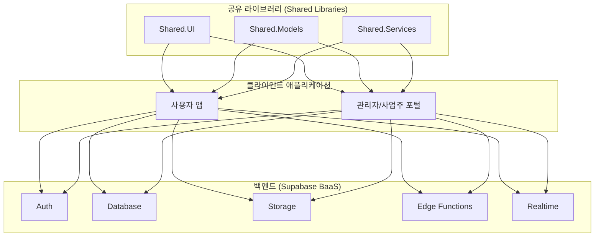

## 개발 정의서: T-Bridge

* **문서 위치:** `/somang_documents/개발정의/개발정의서.md`
* **문서 목적:** 본 문서는 'T-Bridge' 프로젝트의 기술적 사양, 아키텍처, 개발 표준을 정의하여 개발팀의 일관된 이해를 돕고, 프로젝트의 기술적 방향성을 명확히 하는 것을 목적으로 한다. 이는 개발 과정에서 의사결정의 기준이 되는 단일 진실 공급원(Single Source of Truth) 역할을 수행한다.

---

### 1. 기술 스택 요약

프로젝트의 핵심 기술 스택은 아래 표와 같다.

| 구분           | 기술                                                | 비고                                                  |
| :----------- | :------------------------------------------------ | :-------------------------------------------------- |
| **아키텍처**     | .NET MAUI Blazor Hybrid, Blazor Web App           | 코드 재사용성을 극대화하는 하이브리드-퍼스트 모델                         |
| **언어**       | C#, TypeScript, SQL                               | 주 개발 언어는 C#이며, 서버리스 함수 및 DB 로직에 TypeScript와 SQL을 사용 |
| **백엔드**      | Supabase (BaaS)                                   | 백엔드 복잡성을 최소화하는 BaaS-First 전략 채택                     |
| **데이터베이스**   | PostgreSQL                                        | Supabase를 통해 제공되는 관계형 데이터베이스                        |
| **UI 프레임워크** | Radzen Blazor Components                          | 데이터 그리드 등 강력한 엔터프라이즈 기능 제공                          |
| **상태 관리**    | Fluxor                                            | Flux 아키텍처 패턴을 적용하여 예측 가능한 상태 관리 구현                  |
| **배포**       | GitHub Actions, Azure App Service, App/Play Store | CI/CD 파이프라인을 통한 자동화된 배포                             |

---

### 2. 상세 기술 명세

#### 2.1. 기술스택 및 플랫폼

##### 아키텍처 모델: 하이브리드-퍼스트
본 프로젝트는 코드 재사용을 극대화하면서 각 플랫폼에 최적화된 경험을 제공하기 위해 **.NET MAUI Blazor Hybrid 앱**과 **Blazor Web App**을 통합하는 아키텍처를 채택한다. 이를 통해 사용자용 네이티브 앱과 관리자용 웹 포털을 단일 코드베이스에서 효율적으로 관리한다.


<br>

##### 백엔드 전략: BaaS-First (Backend-as-a-Service)
별도의 복잡한 백엔드 API를 구축하는 대신, **Supabase**를 포괄적인 백엔드로 활용하는 BaaS-First 전략을 채택한다. 비즈니스 로직의 상당수는 애플리케이션 계층이 아닌 데이터베이스의 **행 수준 보안(RLS)**과 **Postgres 함수**를 통해 데이터 계층에서 직접 처리된다.

#### 2.2. 언어
* **주요 언어:** **C#** (.NET 8 기반)
* **서버리스/스크립팅 언어:**
    * **TypeScript**: Supabase 엣지 함수(Edge Functions) 개발에 사용
    * **SQL (PL/pgSQL)**: Postgres 함수 및 RLS(행 수준 보안) 정책 정의에 사용

#### 2.3. 플랫폼 및 프레임워크
* **클라이언트 플랫폼:**
    * **사용자 앱:** **.NET MAUI Blazor Hybrid**
    * **관리/사업주 포털:** **Blazor Web App** (`InteractiveServer` 렌더 모드 권장)
* **UI 프레임워크:** **Radzen Blazor Components**
    * 강력한 데이터 그리드, 스케줄러, 차트 등 엔터프라이즈급 기능을 우선으로 고려하여 선정되었다.
* **상태 관리 프레임워크:** **Fluxor**
    * Flux 아키텍처 패턴을 도입하여 예측 가능하고 확장성 있는 중앙 집중식 상태 관리를 구현한다.

#### 2.4. 데이터베이스
* **주요 데이터베이스:** **PostgreSQL** (Supabase를 통해 제공)
* **API 인터페이스:** **PostgREST**
    * 데이터베이스 테이블 및 뷰에 대해 안전한 RESTful 엔드포인트를 자동으로 생성하여 제공한다.
* **핵심 보안 모델:** **행 수준 보안(Row Level Security, RLS)**
    * RLS는 선택이 아닌 **전체 보안 모델의 근간**이다.
    * 사용자 역할(user, owner, admin)에 따라 데이터 접근 규칙을 데이터베이스 수준에서 직접 강제한다.

#### 2.5. 배포 환경
* **CI/CD:** **GitHub Actions**를 사용하여 빌드, 테스트, 배포 파이프라인을 자동화한다.
* **배포 대상 요약:**

| 애플리케이션 | 대상 역할 | 기술 | 배포 대상 | 핵심 아티팩트 |
| :--- | :--- | :--- | :--- | :--- |
| **웹 포털** | 사업주, 관리자 | Blazor Web App (Server) | **Azure App Service** | 게시된 웹 앱 |
| **네이티브 앱** | 최종 사용자 | .NET MAUI Blazor Hybrid | **Apple App Store** | `.ipa` |
| **네이티브 앱** | 최종 사용자 | .NET MAUI Blazor Hybrid | **Google Play Store** | `.aab` |
*출처: `006. 개발환경 정의.md`*

#### 2.6. 의존성 관리
* **패키지 관리자:** **NuGet** (.NET 플랫폼 표준)
* **주요 외부 의존성:**
    * `supabase-csharp`: Supabase와 상호작용하기 위한 핵심 클라이언트 라이브러리 (커뮤니티 지원)
    * `Radzen.Blazor`: UI 컴포넌트 라이브러리
    * `Fluxor.Blazor.Web`: Blazor용 Fluxor 구현체
    * `Plugin.Firebase` (Android): Firebase 푸시 알림 연동
* **리스크 관리:** `supabase-csharp`는 커뮤니티 라이브러리이므로, 직접적인 의존을 피하기 위해 서비스 계층에서 래핑(Wrapping)하여 변경사항에 유연하게 대응할 수 있도록 설계한다.

#### 2.7. 메시징 및 이벤트
* **실시간 통신:** **Supabase Realtime**
    * Postgres의 논리적 복제 기능을 활용하여 DB 변경사항을 구독 중인 클라이언트에 실시간으로 푸시한다. (예: 신규 견적 알림, 채팅 메시지)
* **푸시 알림:**
    * **Android:** Firebase Cloud Messaging (FCM)
    * **iOS:** Apple Push Notification Service (APNS)
    * 알림 발송 로직은 **Supabase 엣지 함수**를 통해 처리한다.

#### 2.8. 스토리지
* **파일 스토리지:** **Supabase Storage**
    * 사용자가 업로드하는 파일(예: 프로필 사진, 사업자등록증 등)을 관리한다.
* **클라이언트 보안 스토리지:** **`Microsoft.Maui.Storage.SecureStorage`**
    * MAUI 앱 내에서 JWT(인증 토큰)와 같은 민감한 데이터를 안전하게 저장하는 데 사용한다.

#### 2.9. 인증
* **인증 서비스:** **Supabase Auth**
* **인증 방식:** **JWT (JSON Web Token)** 기반
* **구현:**
    1.  사용자가 로그인/회원가입 시 Supabase Auth API 호출
    2.  성공 시 반환된 JWT를 클라이언트의 보안 스토리지에 저장
    3.  `CascadingAuthenticationState`를 통해 앱 전반에 인증 상태를 전파하기 위한 커스텀 `AuthenticationStateProvider` 구현

#### 2.10. 클라이언트
* **사용자용 앱 (End-User App):**
    * **기술:** .NET MAUI Blazor Hybrid
    * **주요 타겟:** iOS, Android
* **사업주/관리자 포털 (Business Owner/Admin Portal):**
    * **기술:** Blazor Web App (Server-side)
    * **주요 타겟:** 데스크탑 웹 브라우저

#### 2.11. 개발 환경
* **SDK:** .NET 8
* **IDE:** Visual Studio 2022 (권장), VS Code
* **프로젝트 템플릿:** `maui-blazor-web` .NET CLI 템플릿 사용을 강력히 권장한다.
* **버전 관리:** Git / GitHub

---

### 3. 솔루션 구조

유지보수성과 코드 재사용성을 극대화하기 위해 다음과 같은 다중 프로젝트 솔루션 구조를 채택한다.

```
T-Bridge.sln
│
├── 📁 TBridge.Maui/
│   └── (사용자용 .NET MAUI Blazor Hybrid 프로젝트)
│
├── 📁 TBridge.Web/
│   └── (관리/사업주용 Blazor Web App 프로젝트)
│
├── 📁 TBridge.Shared.UI/
│   └── (공유 Razor 컴포넌트, CSS, JS 등 UI 자원 - RCL)
│
├── 📁 TBridge.Shared.Models/
│   └── (Supabase 테이블과 매핑되는 DTO 및 데이터 모델)
│
└── 📁 TBridge.Shared.Services/
    └── (Supabase 클라이언트, 상태 관리 등 공유 서비스 로직)
```
*출처: `006. 개발환경 정의.md`*