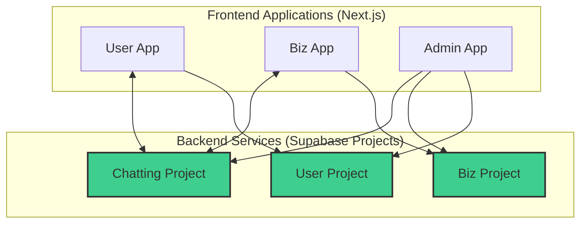

## 기술 스택 정의서: T-Bridge (MSA)

* **문서 목적**: 본 문서는 'T-Bridge' 프로젝트의 4-App 마이크로서비스 아키텍처(MSA)를 구성하는 핵심 기술 스택, 플랫폼, 개발 표준을 정의합니다.

---

### 1. 시스템 아키텍처 개요

T-Bridge는 기능적 역할에 따라 **user-app**, **biz-app**, **admin-app**, **chatting-app**의 4개 독립 애플리케이션/서비스로 분리된 마이크로서비스 아키텍처를 채택합니다. 각 핵심 서비스는 자체 Supabase 프로젝트를 백엔드로 사용하여 완전한 독립성을 보장합니다.

### 2. 공통 기술 스택

| 구분 | 기술 | 선정 이유 |
| :--- | :--- | :--- |
| **코어 프레임워크** | **React 19+, Next.js 14+ (App Router)** | 서버 컴포넌트 기반의 성능 최적화와 유연한 라우팅을 제공하여 모든 웹 애플리케이션의 기반으로 사용합니다. |
| **언어** | **TypeScript** | 대규모 애플리케이션의 안정성과 유지보수성을 위해 모든 코드에 정적 타입을 적용합니다. |
| **백엔드** | **Supabase** | 각 서비스는 독립된 Supabase 프로젝트를 BaaS로 활용하여 인증, DB, 스토리지, 실시간 통신 기능을 구현합니다. |
| **데이터베이스** | **PostgreSQL** | Supabase를 통해 제공되는 관계형 데이터베이스를 사용합니다. |
| **스타일링** | **Tailwind CSS** | 유틸리티 우선 접근 방식으로 모든 앱에서 일관되고 빠른 UI 개발을 지원합니다. |
| **상태 관리** | **Zustand (클라이언트), TanStack Query (서버)** | 클라이언트의 전역 상태는 Zustand로, 서버 데이터의 캐싱 및 동기화는 TanStack Query로 관리하여 상태 로직을 분리합니다. |

### 3. 애플리케이션별 상세 기술

#### 3.1. User App
-   **역할**: 최종 사용자를 위한 서비스 제공 (견적 요청/비교, 판매점 조회, 채팅 등)
-   **플랫폼**: **Next.js** 웹 애플리케이션 (모바일 우선 반응형 디자인)

#### 3.2. Biz App
-   **역할**: 판매점주를 위한 비즈니스 관리 도구 (견적 제출, 상점 관리, 성과 분석 등)
-   **플랫폼**: **Next.js** 웹 애플리케이션 (데스크톱 우선 반응형 디자인)
-   **UI 컴포넌트**: **Ant Design (AntD)** - 복잡한 데이터 그리드 및 차트 구현을 위해 사용합니다.

#### 3.3. Admin App
-   **역할**: 플랫폼 운영을 위한 최고 관리자 도구 (사용자/정책 관리, 데이터 모니터링)
-   **플랫폼**: **Next.js** 웹 애플리케이션
-   **특징**: **여러 Supabase 프로젝트에 동시 연결**하여 모든 데이터를 통합 관리합니다.
-   **UI 컴포넌트**: **Ant Design (AntD)**

#### 3.4. Chatting App (Service)
-   **역할**: User-App과 Biz-App 간의 실시간 채팅 중계
-   **플랫폼**: 독립된 **Supabase 프로젝트**
-   **주요 기능**: 채팅방, 메시지 데이터 관리 및 WebSocket을 통한 실시간 이벤트 브로드캐스팅.