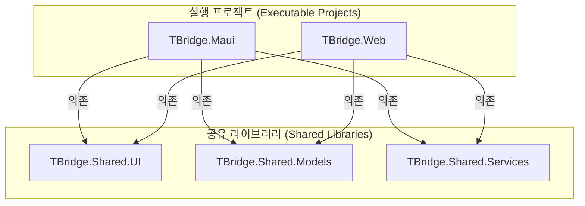

## T-Bridge 프로젝트 목록

본 문서는 'T-Bridge' 솔루션을 구성하는 각 프로젝트의 역할, 주요 기능, 개발 환경을 정의합니다.

### 프로젝트 의존성 다이어그램

 

### 프로젝트 상세 목록

| 프로젝트 명 | 네임스페이스 | 역할 | 주요 기능 | 개발 환경 |
| :--- | :--- | :--- | :--- | :--- |
| **TBridge.Maui** | `TBridge.Maui` | 최종 사용자용 네이티브 클라이언트 앱 | 서비스 검색, 익명 견적 요청, 표준 견적 비교 대시보드, 판매점과 보안 채팅, 마이페이지 등 최종 사용자를 위한 모든 UI 및 기능 제공 | .NET 8 MAUI Blazor Hybrid |
| **TBridge.Web** | `TBridge.Web` | 사업주 및 최고 관리자용 웹 포털 | 사업주 대시보드(매출/주문 관리), 상점 정보 관리, 관리자 대시보드(플랫폼 현황 모니터링), 사용자/사업주 관리 기능 제공 | .NET 8 Blazor Web App (Server) |
| **TBridge.Shared.UI** | `TBridge.Shared.UI` | 공유 UI 컴포넌트 라이브러리 (RCL) | Maui 앱과 Web 앱에서 공통으로 사용되는 모든 Razor 컴포넌트, 레이아웃, CSS/JS 등 UI 관련 리소스를 포함. | .NET 8 Razor Class Library |
| **TBridge.Shared.Models**| `TBridge.Shared.Models` | 공유 데이터 모델 라이브러리 | Supabase 테이블과 매핑되는 DTO(Data Transfer Objects) 및 애플리케이션 전체에서 사용되는 데이터 모델(예: User, Store, Quote)을 정의. | .NET 8 Standard Class Library |
| **TBridge.Shared.Services**|`TBridge.Shared.Services`| 공유 비즈니스 로직 및 서비스 라이브러리 | Supabase 클라이언트 구현, 상태 관리(Fluxor) 로직, 네이티브 기능 인터페이스 등 플랫폼에 종속되지 않는 모든 공유 비즈니스 로직을 포함. | .NET 8 Standard Class Library |