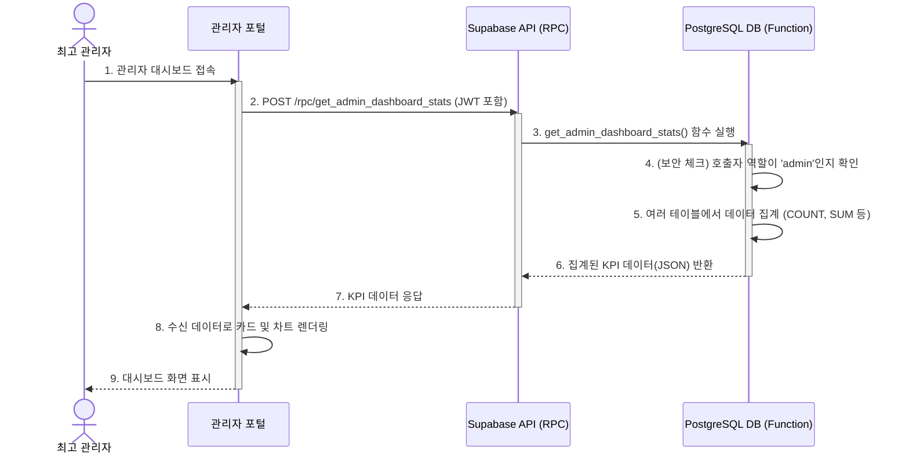

## 기능 명세서: 관리자 대시보드

### 1. 기능 기본 정보

| 항목 | 내용 |
| :--- | :--- |
| **기능 ID** | `FE-ADM-010` |
| **기능명** | 관리자 대시보드 (Admin Dashboard) |
| **설명** | 최고 관리자가 T-Bridge 플랫폼의 전반적인 상태와 핵심 성과 지표(KPI)를 한눈에 파악할 수 있는 종합 현황판입니다. |
| **관련 서비스** | -   **최고 관리자 웹 포털 (TBridge.Web)**: 대시보드 UI 제공 -   **백엔드 (Supabase)**: 플랫폼 전체 데이터를 집계하여 KPI를 계산하고 제공 (DB 함수(RPC) 활용) |

### 2. 요구사항

#### 2.1. 사용자 스토리
> 서비스 운영 상태를 파악해야 하는 **최고 관리자로서**, 플랫폼의 핵심 지표(총 거래액, 활성 사용자 수 등)를 대시보드에서 한눈에 모니터링하여, 비즈니스 현황을 신속하게 파악하고 운영상 주요 이슈에 대응하고 싶다.

#### 2.2. 세부 요구사항 (기능 명세)

-   관리자가 로그인하면 가장 먼저 이 대시보드 화면이 표시되어야 한다.
-   대시보드에는 다음과 같은 플랫폼 전체의 핵심 지표가 카드 형태로 표시되어야 한다:
    -   총 가입자 수
    -   총 승인된 판매점 수
    -   최근 30일간 총 거래 성사 건수
    -   최근 30일간 총 거래액 (GMV)
-   신규 가입자 수, 신규 견적 요청 수 등의 추이를 기간별(일/주/월)로 볼 수 있는 시각화 차트가 제공되어야 한다.
-   '처리 필요 항목' 섹션이 있어, 승인 대기 중인 판매점 수와 같은 즉각적인 조치가 필요한 항목을 표시해야 한다.

#### 2.3. 비기능적 요구사항

-   **보안**: 오직 'admin' 역할을 가진 사용자만 이 대시보드에 접근할 수 있어야 한다. 모든 데이터 조회 API는 RLS 정책을 통해 호출자의 역할을 엄격히 검증해야 한다.
-   **성능**: 여러 테이블의 데이터를 집계해야 하므로, 최적화된 DB 함수를 사용하여 3초 이내에 모든 대시보드 데이터가 로드되어야 한다.
-   **데이터 정확성**: 대시보드에 표시되는 모든 통계 수치는 실제 데이터베이스의 상태를 정확하게(Near Real-time) 반영해야 한다.

### 3. 데이터 흐름

1.  **화면 진입**: 'admin' 역할의 사용자가 관리자 포털에 로그인하여 대시보드 페이지로 이동합니다.
2.  **데이터 요청**: 클라이언트(관리자 포털)는 대시보드에 필요한 모든 집계 데이터를 가져오기 위해 단일 RPC(원격 프로시저 호출) API를 호출합니다. (예: `POST /rpc/get_admin_dashboard_stats`)
3.  **백엔드 처리**: 백엔드에서는 `get_admin_dashboard_stats`라는 PostgreSQL 함수가 실행됩니다. 이 함수는 실행 전, 호출자의 역할이 'admin'인지 내부적으로 검증합니다. 검증 통과 시, 함수는 `profiles`, `stores`, `quotes` 등 여러 테이블에 대해 `COUNT`, `SUM` 등의 집계 쿼리를 실행하여 모든 KPI 데이터를 계산하고 단일 JSON 객체로 만듭니다.
4.  **데이터 응답**: 백엔드는 집계된 KPI 데이터가 담긴 JSON 객체를 클라이언트에 반환합니다.
5.  **UI 렌더링**: 클라이언트는 수신한 데이터를 사용하여 대시보드의 각 KPI 카드와 차트를 채워 화면에 표시합니다.

#### Sequence Diagram

