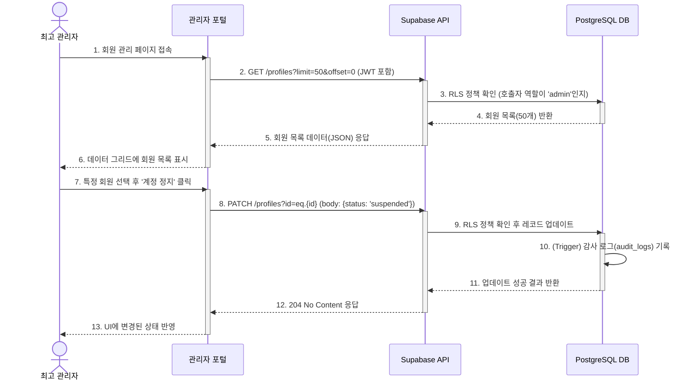

## 기능 명세서: 회원 관리

### 1. 기능 기본 정보

| 항목         | 내용                                                                                                              |
| :--------- | :-------------------------------------------------------------------------------------------------------------- |
| **기능 ID** | `FE-ADM-020`                                                                                                    |
| **기능명** | 회원 관리 (Member Management)                                                                                       |
| **설명** | 최고 관리자가 플랫폼에 가입된 모든 사용자(일반 사용자, 사업주)의 목록을 조회, 검색하고 계정 상태를 관리하는 기능입니다. 플랫폼 운영 및 정책 집행을 위한 필수 기능입니다.              |
| **관련 서비스** | -   **최고 관리자 웹 포털 (TBridge.Web)**: 회원 관리 UI 제공 -   **백엔드 (Supabase)**: `profiles`, `stores` 테이블의 데이터 조회 및 수정 | 

### 2. 요구사항

#### 2.1. 사용자 스토리
> 플랫폼의 건전성을 유지해야 하는 **최고 관리자로서**, 전체 사용자와 사업주 목록을 조회하고, 필요시 계정 상태를 변경하거나 가입을 승인/거절하여, 안전하고 신뢰도 높은 서비스 환경을 만들고 싶다.

#### 2.2. 세부 요구사항 (기능 명세)

-   관리자는 전체 회원 목록을 페이지네이션이 적용된 데이터 그리드로 볼 수 있어야 한다.
-   회원 목록은 이름, 이메일, 역할 등 다양한 조건으로 검색 및 필터링이 가능해야 한다.
-   관리자는 특정 회원의 상세 정보(가입일, 활동 내역 요약 등)를 조회할 수 있어야 한다.
-   관리자는 특정 회원의 계정 상태를 '활성', '정지' 등으로 변경할 수 있어야 한다.
-   신규 사업자(판매점)의 가입 신청을 심사하고 '승인' 또는 '거절' 처리를 할 수 있는 별도의 관리 화면이 제공되어야 한다. (FE-BIZ-010 연관)

#### 2.3. 비기능적 요구사항

-   **보안**: 이 기능의 모든 API 엔드포인트는 오직 'admin' 역할을 가진 사용자만 호출할 수 있도록 RLS 정책으로 엄격하게 보호되어야 한다.
-   **성능**: 수만 명 이상의 회원 목록을 다룰 수 있도록 서버 사이드 페이지네이션 및 검색 기능이 구현되어야 하며, 각 페이지는 2초 이내에 로드되어야 한다.
-   **감사 추적 (Audit Trail)**: 관리자가 회원의 상태를 변경하는 등 주요 작업을 수행할 때마다, 작업 내용(누가, 언제, 무엇을)이 공식 **`audit_logs`** 테이블에 기록되어야 한다.

### 3. 데이터 흐름

1.  **회원 목록 조회**: 관리자가 '회원 관리' 페이지에 접속하면, 클라이언트(관리자 포털)는 페이지네이션 정보(예: `offset=0`, `limit=50`)와 함께 백엔드의 `GET /profiles` 엔드포인트를 호출합니다.
2.  **인가 및 데이터 조회**: Supabase는 요청 헤더의 JWT를 통해 호출자가 'admin' 역할인지 RLS 정책으로 확인합니다. 확인이 완료되면, `profiles` 테이블에서 조건에 맞는 회원 목록을 조회하여 반환합니다.
3.  **UI 렌더링**: 클라이언트는 수신한 회원 목록 데이터를 데이터 그리드에 표시합니다.
4.  **상태 변경 요청**: 관리자가 특정 회원을 선택하고 '계정 정지' 버튼을 클릭합니다.
5.  **업데이트 API 호출**: 클라이언트는 해당 회원의 ID와 변경할 상태 값을 담아 `PATCH /profiles?id=eq.{user_id}` API를 호출합니다. (Request Body: `{"status": "suspended"}`)
6.  **백엔드 처리**: RLS 정책으로 관리자 권한을 다시 한번 확인한 후, `profiles` 테이블의 해당 레코드를 업데이트합니다. 이와 동시에, DB 트리거가 작동하여 `audit_logs` 테이블에 변경 이력을 기록합니다.
7.  **성공 응답 및 UI 갱신**: 백엔드는 `204 No Content` 성공 코드를 반환하고, 클라이언트는 데이터 그리드에서 해당 회원의 상태를 '정지'로 즉시 갱신합니다.

#### Sequence Diagram

