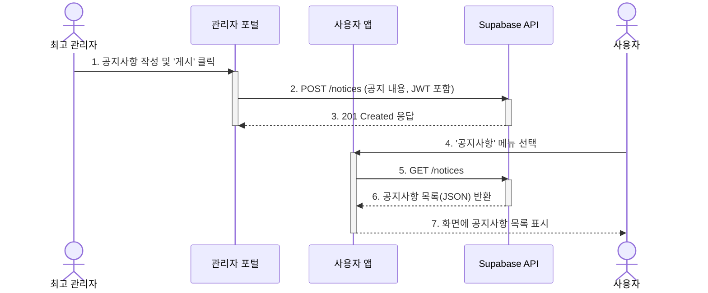

## 기능 명세서: 정책 및 콘텐츠 관리

### 1. 기능 기본 정보

| 항목 | 내용 |
| :--- | :--- |
| **기능 ID** | `FE-ADM-030` |
| **기능명** | 정책 및 콘텐츠 관리 (Policy & Content Management) |
| **설명** | 최고 관리자가 플랫폼의 주요 콘텐츠(공지사항, 약관 등)와 핵심 정책(예: 인증 판매점 지정)을 생성하고 관리하는 기능입니다. 이를 통해 서비스 운영의 유연성과 통제력을 확보합니다. |
| **관련 서비스** | -   **최고 관리자 웹 포털 (TBridge.Web)**: 콘텐츠 및 정책 관리 UI 제공 -   **사용자 앱 (TBridge.Maui)**: 관리자가 생성한 콘텐츠(공지사항 등)를 조회하는 UI -   **백엔드 (Supabase)**: 관련 데이터를 각 테이블(`notices`, `stores` 등)에 저장 및 관리 |

### 2. 요구사항

#### 2.1. 사용자 스토리
> 플랫폼의 원활한 운영을 위해 **최고 관리자로서**, 사용자에게 공지사항을 알리고, 서비스 약관을 최신으로 유지하며, '인증 성지' 같은 핵심 정책을 직접 관리하고 싶다.

#### 2.2. 세부 요구사항 (기능 명세)

-   관리자는 관리자 포털에서 공지사항을 작성, 수정, 게시 및 삭제할 수 있어야 한다.
-   공지사항 작성 시, 리치 텍스트 에디터(WYSIWYG)가 제공되어야 한다.
-   관리자는 서비스 이용약관 및 개인정보처리방침의 내용을 수정하고, 변경 이력을 관리할 수 있어야 한다.
-   관리자는 특정 판매점을 'T-Bridge 인증 성지'로 지정하거나 해제할 수 있는 인터페이스가 있어야 한다.
-   (향후 확장) 수수료율, 프로모션 기본 정책 등 플랫폼의 주요 시스템 파라미터를 수정할 수 있는 설정 페이지가 제공되어야 한다.

#### 2.3. 비기능적 요구사항

-   **보안**: 이 기능의 모든 엔드포인트는 오직 'admin' 역할을 가진 사용자만 접근할 수 있도록 RLS 정책으로 엄격히 통제되어야 한다.
-   **감사 추적 (Audit Trail)**: 약관이나 주요 정책(인증 성지 지정 등) 변경 시, 변경 이력(변경자, 시각, 변경 내용)이 반드시 로그로 기록되어야 한다.
-   **사용성**: 관리자가 기술적인 지식 없이도 쉽게 콘텐츠를 작성하고 정책을 변경할 수 있도록 직관적인 UI를 제공해야 한다.
-   **버전 관리**: 이용약관과 같이 법적 효력을 갖는 문서는 변경 시 버전을 명시적으로 관리해야 한다.

### 3. 데이터 흐름

1.  **콘텐츠 생성 (공지사항 예시)**: 관리자가 관리자 포털에서 '공지사항 관리' 메뉴로 들어가 '새 공지 작성' 버튼을 클릭합니다.
2.  **작성 및 게시**: 관리자는 리치 텍스트 에디터를 사용하여 공지 내용을 작성하고 '게시' 버튼을 클릭합니다.
3.  **API 요청**: 클라이언트(관리자 포털)는 작성된 공지 내용을 담아 `POST /notices` API를 호출합니다.
4.  **백엔드 처리**: 백엔드는 RLS 정책을 통해 관리자 권한을 확인한 후, `notices` 테이블에 새로운 공지사항 레코드를 `INSERT`합니다.
5.  **성공 응답**: 백엔드는 `201 Created` 응답을 클라이언트에 반환하고, 관리자 포털의 공지 목록이 갱신됩니다.
6.  **콘텐츠 조회 (사용자 앱)**: 최종 사용자가 앱 내 '공지사항' 메뉴에 진입합니다.
7.  **조회 API 요청**: 클라이언트(사용자 앱)는 `GET /notices?order=created_at.desc` API를 호출하여 최신순으로 정렬된 공지사항 목록을 요청합니다.
8.  **데이터 반환**: 백엔드는 모든 사용자가 읽을 수 있도록 허용된 RLS 정책에 따라 공지사항 목록을 조회하여 반환합니다.
9.  **UI 렌더링**: 사용자 앱은 수신한 데이터를 목록 형태로 사용자에게 보여줍니다.

#### Sequence Diagram

