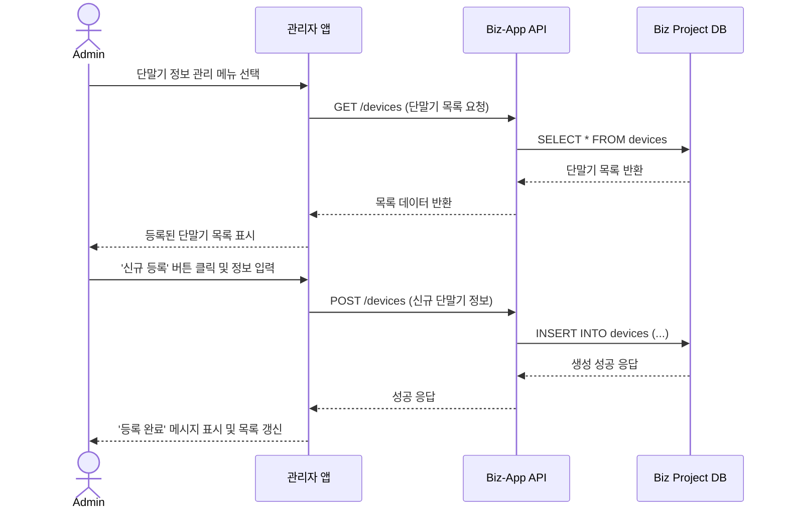

# 기능 명세: 단말기 정보 관리

-   **기능 ID**: `FE-ADM-040`
-   **기능 Epic**: `관리자 기능`
-   **담당자/작성자**:
-   **작성일**: `2025-06-23`

## 1. 기능 개요
최고관리자가 시스템의 기준 정보가 되는 휴대폰 단말기(Device) 정보를 생성, 조회, 수정, 삭제(CRUD)하는 기능. 이곳에 등록된 단말기 정보는 사용자와 판매점이 견적을 요청하거나 등록할 때 모델 선택 목록 등으로 사용된다.

## 2. 관련 서비스
-   **admin-app**: 단말기 정보 CRUD UI 제공
-   **biz-app (Supabase Project)**: **단말기 마스터 데이터의 실제 저장소 역할**
-   **user-app, biz-app**: `biz-app`의 DB에서 단말기 정보를 읽어와 화면에 표시

## 3. 기능 상세 (Sequence Diagram)

