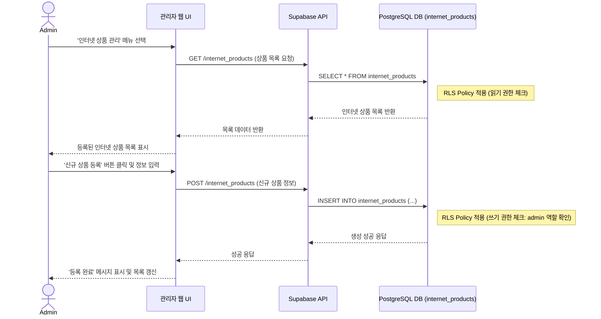

# 기능 명세: 인터넷 상품 관리

-   **기능 ID**: `FE-ADM-050`
-   **기능 Epic**: `관리자 기능`
-   **담당자/작성자**:
-   **작성일**: `2025-06-23`

## 1. 기능 개요
최고관리자가 플랫폼에서 제공하는 인터넷 및 TV 결합 상품의 기준 정보를 생성, 조회, 수정, 삭제(CRUD)하는 기능이다.
이곳에 등록된 상품 정보는 사용자가 '인터넷' 관련 견적을 요청할 때 기준이 되는 마스터 데이터로 활용된다.

## 2. Actor
-   `최고관리자 (Admin)`

## 3. 전제 조건
-   관리자 계정으로 시스템에 로그인되어 있다.
-   관리자 페이지의 '인터넷 상품 관리' 메뉴에 접근할 수 있다.

## 4. 기능 상세 (Sequence Diagram)

## 5. 성공 시나리오 (Postconditions)
1.  **생성(Create)**: 관리자가 입력한 인터넷 상품 정보(통신사, 속도, 가격, 약정 등)가 `internet_products` 테이블에 성공적으로 저장된다.
2.  **조회(Read)**: `internet_products` 테이블에 저장된 상품 정보 목록을 관리자 페이지에서 확인할 수 있다.
3.  **수정(Update)**: 기존 인터넷 상품의 정보를 수정하고 저장할 수 있다.
4.  **삭제(Delete)**: 특정 인터넷 상품 정보를 목록에서 삭제할 수 있다. (Soft Delete: `deleted_at` 컬럼에 현재 시각 기록)

## 6. 예외 시나리오
-   필수 입력값 누락 시, UI 단에서 유효성 검사 오류를 표시한다.
-   관리자가 아닌 사용자가 API를 통해 데이터 조작을 시도할 경우, RLS 정책에 의해 차단된다.