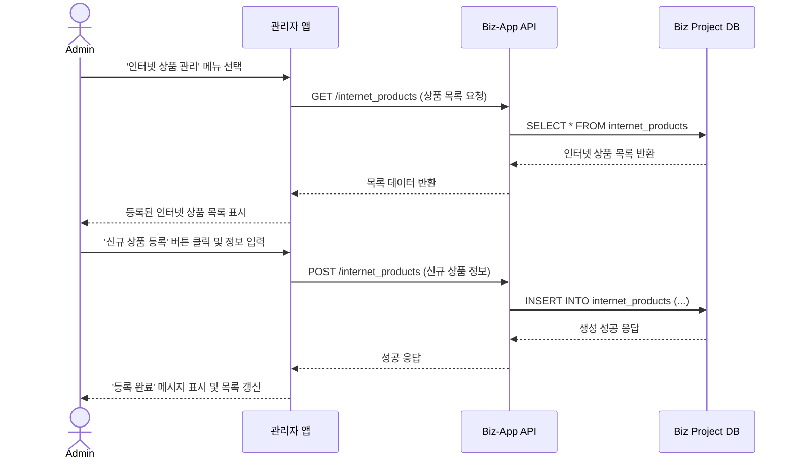

# 기능 명세: 인터넷 상품 관리

-   **기능 ID**: `FE-ADM-050`
-   **기능 Epic**: `관리자 기능`
-   **담당자/작성자**:
-   **작성일**: `2025-06-23`

## 1. 기능 개요
최고관리자가 플랫폼에서 제공하는 인터넷 및 TV 결합 상품의 기준 정보를 생성, 조회, 수정, 삭제(CRUD)하는 기능이다. 이곳에 등록된 상품 정보는 사용자가 '인터넷' 관련 견적을 요청할 때 기준이 되는 마스터 데이터로 활용된다.

## 2. 관련 서비스
-   **admin-app**: 인터넷 상품 정보 CRUD UI 제공
-   **biz-app (Supabase Project)**: **인터넷 상품 마스터 데이터의 실제 저장소 역할**
-   **user-app, biz-app**: `biz-app`의 DB에서 상품 정보를 읽어와 화면에 표시

## 3. 기능 상세 (Sequence Diagram)

