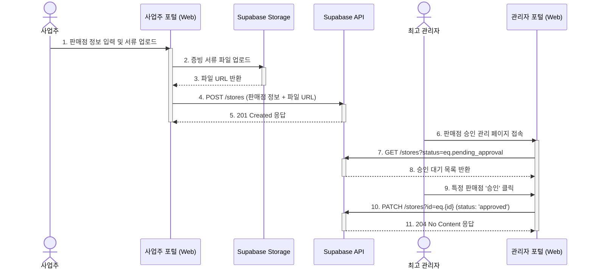

## 기능 명세서: 판매점 관리

### 1. 기능 기본 정보

| 항목 | 내용 |
| :--- | :--- |
| **기능 ID** | `FE-BIZ-010` |
| **기능명** | 판매점 관리 (Store Management) |
| **설명** | 사업주(판매점주)가 T-Bridge 플랫폼에 자신의 판매점 정보를 등록하고, 사업자 인증을 요청하며, 승인 후 정보를 수정하는 기능입니다. 최고 관리자는 이 등록 요청을 심사하고 승인하는 역할을 포함합니다. |
| **관련 서비스** | -   **사업주 웹 포털 (TBridge.Web)**: 판매점주가 정보를 등록하고 관리하는 UI 제공 -   **최고 관리자 웹 포털 (TBridge.Web)**: 관리자가 등록 요청을 심사하는 UI 제공 -   **백엔드 (Supabase)**: `stores` 테이블에 정보 저장, `Storage`에 인증 서류 파일 저장 |

### 2. 요구사항

#### 2.1. 사용자 스토리
> T-Bridge에 입점하여 새로운 고객을 만나고 싶은 **판매점주로서**, 내 가게의 정보를 간편하게 등록하고 사업자 인증을 받아, 플랫폼에서 신뢰도 있는 판매자로 활동하고 싶다.

#### 2.2. 세부 요구사항 (기능 명세)

-   '사업주' 역할을 가진 사용자는 웹 포털에서 '내 판매점 등록' 페이지에 접근할 수 있어야 한다.
-   판매점 등록 폼에는 상호명, 주소, 소개글, 대표 이미지 등 기본 정보를 입력할 수 있어야 한다.
-   사업자 인증을 위해 사업자등록증과 같은 증빙 서류를 업로드할 수 있는 기능이 있어야 한다.
-   등록 요청을 제출하면, 해당 판매점 정보는 '승인 대기' 상태로 데이터베이스에 저장되어야 한다.
-   최고 관리자는 관리자 포털에서 '판매점 승인 관리' 페이지를 통해 승인 대기 중인 판매점 목록을 확인할 수 있어야 한다.
-   관리자는 각 요청의 상세 정보와 증빙 서류를 검토한 후 '승인' 또는 '거절' 처리를 할 수 있어야 한다.
-   판매점주'는 자신의 판매점 정보가 승인된 이후에는 해당 정보를 수정할 수 있어야 한다.

#### 2.3. 비기능적 요구사항

-   **보안**: 오직 '사업주' 역할을 가진 사용자만 판매점을 등록/수정할 수 있으며, 자신의 `owner_id`와 일치하는 판매점만 수정할 수 있어야 한다. 업로드된 서류는 지정된 관리자만 접근할 수 있도록 스토리지 접근 정책이 설정되어야 한다.
-   **성능**: 사업주 포털의 판매점 관리 페이지는 3초 이내에 로드되어야 하며, 서류 업로드 시 진행 상태가 표시되어야 한다.
-   **안정성**: 파일 업로드 중 네트워크 오류가 발생하더라도 업로드를 재개하거나, 오류 메시지를 명확히 표시해야 한다.

### 3. 데이터 흐름

1.  **판매점 등록 요청**: '사업주' 사용자가 웹 포털에서 판매점 정보를 입력하고 증빙 서류 파일을 업로드한 후 '등록 요청' 버튼을 클릭합니다.
2.  **파일 업로드**: 클라이언트는 먼저 증빙 서류 파일을 Supabase Storage에 업로드하고, 업로드된 파일의 고유 URL을 반환받습니다.
3.  **정보 제출**: 클라이언트는 입력된 판매점 정보와 파일 URL을 담아 백엔드의 `POST /stores` 엔드포인트로 API 요청을 보냅니다. 이때 요청의 주체는 현재 로그인한 사업주입니다.
4.  **데이터 저장**: 백엔드는 RLS 정책에 따라 요청 권한을 확인한 후, `stores` 테이블에 `owner_id`를 현재 사용자 ID로 설정하여 '승인 대기' 상태의 새 레코드를 생성합니다.
5.  **관리자 검토**: 최고 관리자가 관리자 포털의 '판매점 승인 관리' 페이지에 접속하면, 클라이언트는 `GET /stores?status=eq.pending_approval` API를 호출하여 승인 대기 목록을 가져옵니다.
6.  **승인 처리**: 관리자가 특정 요청을 '승인'하면, 클라이언트는 `PATCH /stores?id=eq.{store_id}` API를 호출하여 해당 레코드의 `status`를 'approved'로 변경합니다.
7.  **결과 통보**: 상태가 변경되면, 데이터베이스 트리거나 엣지 함수를 통해 해당 사업주에게 승인 완료 알림(푸시 또는 이메일)을 보낼 수 있습니다.

#### Sequence Diagram

