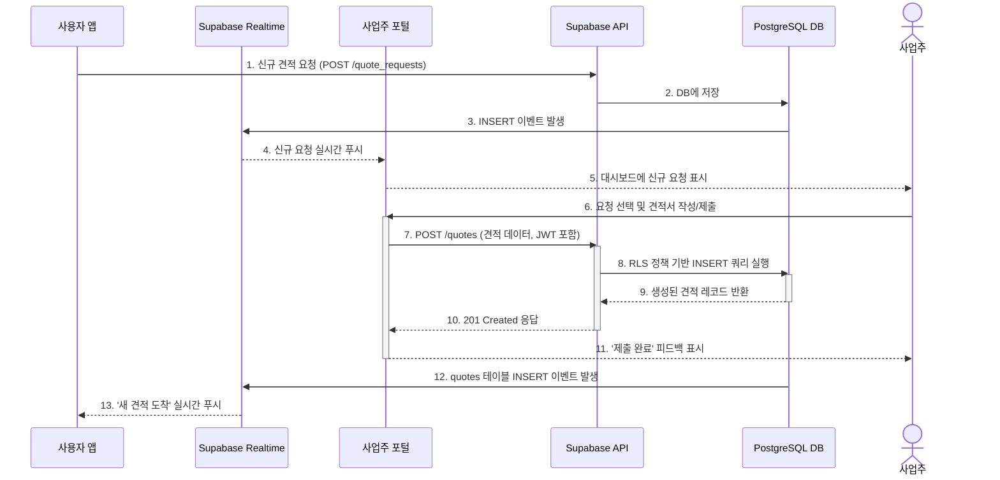

## 기능 명세서: 판매점 견적 관리

### 1. 기능 기본 정보

| 항목         | 내용                                                                                                                        |
| :--------- | :------------------------------------------------------------------------------------------------------------------------ |
| **기능 ID**  | `FE-BIZ-020`                                                                                                              |
| **기능명**    | 판매점 견적 관리 (Store Quote Management)                                                                                        |
| **설명**     | 판매점주가 자신의 영업 조건에 맞는 신규 고객 견적 요청을 실시간으로 확인하고, T-Bridge 플랫폼이 제공하는 표준화된 양식에 맞춰 경쟁력 있는 견적을 작성하여 고객에게 제출하는 핵심 영업 기능입니다.        |
| **관련 서비스** | -   **사업주 웹 포털 (TBridge.Web)**: 견적 요청을 확인하고 견적을 제출하는 주 인터페이스 -   **백엔드 (Supabase)**: 견적 요청 목록 제공, 제출된 견적 저장, 실시간 알림 중계 |

### 2. 요구사항

#### 2.1. 사용자 스토리
> 내 매장의 매출을 올리고 싶은 **판매점주로서**, 플랫폼을 통해 들어온 고객의 견적 요청을 실시간으로 확인하고, 나의 가장 경쟁력 있는 가격과 혜택을 담은 견적을 신속하게 제출하고 싶다.

#### 2.2. 세부 요구사항 (기능 명세)

-   사업주 포털 대시보드에는 신규 고객 견적 요청이 실시간으로 표시되어야 한다.
-   판매점은 각 요청의 상세 내용(요청 상품, 조건 등)을 확인할 수 있어야 한다.
-   견적을 제출하기 위해, T-Bridge가 정의한 표준 양식(출고가, 지원금, 월 납부액 등)을 사용해야 한다.
-   견적 제출 시, '실질 할부원금'과 같은 핵심 지표는 입력 값에 따라 자동으로 계산될 수 있다.
-   견적을 제출하면, 해당 요청은 '견적 완료' 상태로 변경되고, 고객에게 즉시 전달되어야 한다.

#### 2.3. 비기능적 요구사항

-   **실시간성**: 신규 견적 요청이 발생하면 5초 이내에 사업주 대시보드에 반영되어야 한다. (Supabase Realtime 활용)
-   **보안**: 판매점주는 자신이 소유한 판매점(`stores` 테이블의 `owner_id` 일치)의 이름으로만 견적을 제출할 수 있어야 한다. 이는 `quotes` 테이블의 `INSERT`에 대한 RLS 정책으로 강제된다.
-   **성능**: 견적 제출 폼은 즉각적으로 반응해야 하며, 제출 후 2초 이내에 성공 피드백을 받아야 한다.
-   **정확성**: 견적서의 자동 계산 로직(TCO, 할부원금 등)은 오류가 없어야 한다.

### 3. 데이터 흐름

1.  **실시간 요청 수신**: 최종 사용자가 견적 요청(`quote_requests`)을 생성하면, 이 이벤트가 Supabase Realtime을 통해 사업주 포털 클라이언트에 전달됩니다.
2.  **대시보드 업데이트**: 사업주 포털은 수신한 실시간 이벤트를 바탕으로 대시보드의 '신규 요청' 목록을 동적으로 업데이트합니다.
3.  **견적서 작성**: 판매점주가 특정 요청을 클릭하면, 해당 `request_id`에 대한 상세 정보가 표시되고, 표준 견적서 작성 UI가 나타납니다.
4.  **견적 제출**: 판매점주가 견적 내용을 모두 입력하고 '제출' 버튼을 클릭합니다.
5.  **API 요청**: 클라이언트는 작성된 견적 정보와 `request_id`, `store_id`를 포함하여 백엔드의 `POST /quotes` 엔드포인트로 API 요청을 보냅니다.
6.  **백엔드 처리 및 인가**: Supabase는 JWT를 통해 판매점주를 인증합니다. RLS 정책은 해당 판매점주가 요청에 명시된 `store_id`의 소유주가 맞는지 검증한 후, `quotes` 테이블에 새로운 레코드를 `INSERT`합니다.
7.  **사용자에게 알림**: `quotes` 테이블의 `INSERT` 이벤트는 다시 Supabase Realtime을 통해 원래 견적을 요청했던 최종 사용자에게 '새로운 견적이 도착했습니다'라는 알림을 트리거합니다.
8.  **성공 응답**: 백엔드는 `201 Created` 상태 코드와 함께 성공적으로 생성된 견적 데이터를 클라이언트(사업주 포털)에 반환하고, UI는 '제출 완료' 상태로 업데이트됩니다.

#### Sequence Diagram

