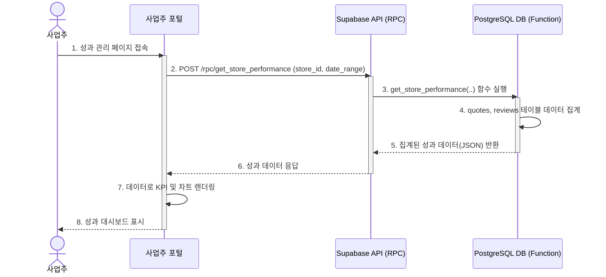

## 기능 명세서: 판매점 성과 관리

### 1. 기능 기본 정보

| 항목 | 내용 |
| :--- | :--- |
| **기능 ID** | `FE-BIZ-030` |
| **기능명** | 판매점 성과 관리 (Store Performance Management) |
| **설명** | 판매점주가 플랫폼 내에서의 자신의 영업 활동 성과를 데이터 기반으로 확인하고 분석할 수 있는 대시보드 기능입니다. 이를 통해 판매점주는 자신의 가격 정책 및 서비스 전략을 개선할 수 있습니다. |
| **관련 서비스** | -   **사업주 웹 포털 (TBridge.Web)**: 성과 대시보드 UI 제공 -   **백엔드 (Supabase)**: 성과 지표 계산을 위한 데이터 집계 및 제공 (주로 DB 함수(RPC) 활용) |

### 2. 요구사항

#### 2.1. 사용자 스토리
> 매출을 증대시키고 싶은 **사업주로서**, 나의 영업 활동 성과(응답률, 채택률 등)를 데이터로 확인하여, 나의 가격 정책과 서비스 전략을 개선하고 싶다.

#### 2.2. 세부 요구사항 (기능 명세)

-   성과 대시보드에는 지정된 기간 동안의 핵심 성과 지표(KPI)가 표시되어야 한다.
    -   총 견적 발송 수
    -   견적 채택률 (Conversion Rate)
    -   평균 고객 평점
-   사용자는 조회 기간을 설정할 수 있어야 한다 (예: 최근 7일, 최근 30일, 월별).
-   주요 성과 지표의 추이를 시각적으로 파악할 수 있도록 차트나 그래프가 제공되어야 한다.
-   자신이 받은 최신 고객 리뷰 및 평점 목록을 확인할 수 있어야 한다.

#### 2.3. 비기능적 요구사항

-   **성능**: 대시보드 로딩 시 모든 성과 데이터와 차트는 4초 이내에 표시되어야 한다. 이를 위해 데이터 집계는 최적화된 데이터베이스 뷰 또는 함수(RPC)를 통해 처리되어야 한다.
-   **데이터 정확성**: 대시보드에 표시되는 모든 수치(채택률, 평균 평점 등)는 원본 데이터를 기반으로 정확하게 계산되어야 한다.
-   **보안**: 판매점주는 오직 자신이 소유한 판매점의 성과 데이터만 조회할 수 있어야 한다. (RLS 정책으로 강제)
-   **사용성**: 데이터와 차트는 판매점주가 직관적으로 자신의 성과를 이해할 수 있도록 명확하고 이해하기 쉽게 시각화되어야 한다.

### 3. 데이터 흐름

1.  **화면 진입**: 판매점주가 사업주 포털에 로그인하여 '성과 관리' 또는 '대시보드' 메뉴로 이동합니다.
2.  **데이터 요청**: 클라이언트는 현재 로그인된 판매점주의 `store_id`와 기본 조회 기간(예: 최근 30일)을 파라미터로 하여, 백엔드(Supabase)의 특정 RPC(원격 프로시저 호출) 엔드포인트로 성과 데이터를 요청합니다. (예: `POST /rpc/get_store_performance`)
3.  **백엔드 집계 처리**: `get_store_performance` DB 함수가 호출됩니다. 이 함수는 `quotes` 테이블과 `reviews` 테이블을 기반으로 다음을 계산합니다.
    -   기간 내 총 견적 제출 건수 (`COUNT`)
    -   기간 내 `status`가 'accepted'인 견적 건수 (`COUNT` + `FILTER`)
    -   견적 채택률 (accepted / total)
    -   기간 내 평균 평점 (`AVG(rating)`)
    -   이 모든 집계 결과를 단일 JSON 객체로 패키징합니다.
4.  **데이터 응답**: 백엔드는 집계된 JSON 객체를 클라이언트에 반환합니다.
5.  **UI 렌더링**: 클라이언트는 수신한 데이터를 사용하여 대시보드의 KPI 카드와 차트를 렌더링합니다.
6.  **리뷰 목록 조회**: 대시보드의 '최신 리뷰' 섹션을 위해, 클라이언트는 별도로 `GET /reviews?store_id=eq.{id}&order=created_at.desc` API를 호출하여 최신 리뷰 목록을 가져와 표시합니다.

#### Sequence Diagram

