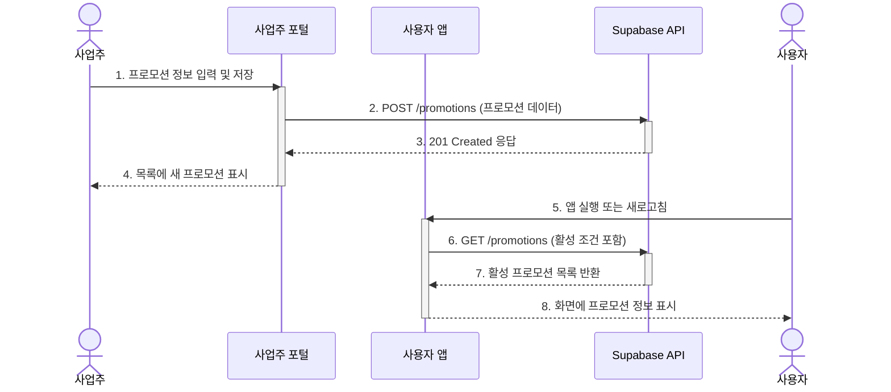

## 기능 명세서: 프로모션 관리

### 1. 기능 기본 정보

| 항목         | 내용                                                                                                                                                                      |
| :--------- | :---------------------------------------------------------------------------------------------------------------------------------------------------------------------- |
| **기능 ID**  | `FE-BIZ-040`                                                                                                                                                            |
| **기능명**    | 프로모션 관리 (Promotion Management)                                                                                                                                          |
| **설명**     | 판매점주가 자신의 판매점에 대한 특별 할인 이벤트나 프로모션(예: 오늘의 특가, 선착순 할인)을 직접 생성, 수정, 관리할 수 있는 기능입니다. 이를 통해 능동적인 마케팅 활동을 지원합니다.                                                              |
| **관련 서비스** | -   **사업주 웹 포털 (TBridge.Web)**: 프로모션 생성 및 관리 UI 제공 -   **사용자 앱 (TBridge.Maui)**: 사용자에게 활성화된 프로모션 노출 -   **백엔드 (Supabase)**: 프로모션 정보 저장 및 조회 (`promotions` 테이블 가정) |

### 2. 요구사항

#### 2.1. 사용자 스토리
> 적극적인 영업을 하고 싶은 **사업주로서**, '오늘의 특가'와 같은 프로모션 이벤트를 직접 생성하고 관리하여, 고객의 주목도를 높이고 단기 매출을 증대시키고 싶다.

#### 2.2. 세부 요구사항 (기능 명세)

-   판매점주는 사업주 포털 내 '프로모션 관리' 페이지에 접근할 수 있어야 한다.
-   '새 프로모션 만들기' 기능을 통해 프로모션을 생성할 수 있어야 한다.
-   프로모션 생성 시, 제목, 설명, 할인 내용, 대상 상품, 시작일, 종료일을 설정할 수 있어야 한다.
-   자신이 생성한 프로모션 목록을 '진행 중', '예정', '종료' 상태별로 확인할 수 있어야 한다.
-   아직 시작되지 않은 '예정' 상태의 프로모션은 수정하거나 삭제할 수 있어야 한다.
-   생성된 프로모션은 사용자 앱의 특정 영역(예: 메인 화면, '성지'딜 허브)에 노출되어야 한다.

#### 2.3. 비기능적 요구사항

-   **보안**: 판매점주는 자신이 소유한 판매점의 프로모션만 생성 및 관리할 수 있어야 한다. 이는 `promotions` 테이블의 RLS 정책을 통해 강제되어야 한다.
-   **성능**: 사용자 앱에서 활성화된 프로모션 목록은 1.5초 이내에 로드되어야 한다. 이를 위해 `promotions` 테이블의 날짜 컬럼에 인덱싱이 필요하다.
-   **정확성**: 프로모션의 시작 및 종료 시각은 정확히 적용되어, 지정된 기간에만 사용자에게 노출되어야 한다.

### 3. 데이터 흐름

1.  **프로모션 생성**: 판매점주가 사업주 포털에서 '새 프로모션 만들기'를 선택하고, 프로모션 상세 내용을 입력 후 '저장' 버튼을 클릭합니다.
2.  **생성 요청**: 클라이언트(사업주 포털)는 입력된 정보를 바탕으로 `POST /promotions` API를 호출합니다. 요청 본문에는 프로모션 내용과 `store_id`가 포함됩니다.
3.  **데이터 저장**: 백엔드는 RLS 정책으로 요청 권한을 확인한 후, `promotions` 테이블에 새로운 프로모션 정보를 저장합니다.
4.  **생성 완료**: 백엔드는 `201 Created` 응답을 반환하고, 사업주 포털의 프로모션 목록이 갱신됩니다.
5.  **프로모션 조회 (사용자 앱)**: 최종 사용자가 T-Bridge 앱을 실행하면, 클라이언트는 현재 시각을 기준으로 활성화된 프로모션 목록을 요청합니다. (예: `GET /promotions?start_date=lte.now()&end_date=gte.now()`)
6.  **데이터 조회**: 백엔드는 RLS 정책에 따라 조회 권한을 확인하고, 조건에 맞는 활성 프로모션 목록을 조회하여 반환합니다.
7.  **UI 노출**: 클라이언트(사용자 앱)는 수신한 프로모션 목록을 메인 화면의 배너나 '특가' 탭 등에 표시합니다.

#### Sequence Diagram

