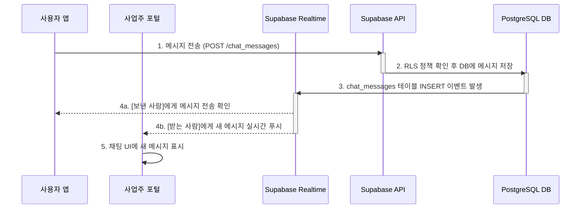

## 기능 명세서: 보안 채팅

### 1. 기능 기본 정보

| 항목 | 내용 |
| :--- | :--- |
| **기능 ID** | `FE-COM-010` |
| **기능명** | 보안 채팅 (Secure Chat) |
| **설명** | 사용자가 견적을 수락한 판매점과 1:1로 안전하게 소통할 수 있는 실시간 채팅 기능입니다. 모든 대화 내용은 서버에 저장되어 향후 발생할 수 있는 분쟁의 증거 자료로 활용됩니다. |
| **관련 서비스** | -   **사용자 앱 (TBridge.Maui)**: 최종 사용자의 채팅 UI 제공 -   **사업주 웹 포털 (TBridge.Web)**: 판매점주의 채팅 UI 제공 -   **백엔드 (Supabase)**: `chat_rooms`, `chat_messages` 테이블에 대화 내용 저장 및 `Realtime` 서비스를 통한 메시지 실시간 중계 |

### 2. 요구사항

#### 2.1. 사용자 스토리
> 판매점의 말바꿈이 걱정되는 **사용자로서**, 견적을 수락한 판매점과 앱 내에서만 소통하여, 약속된 모든 조건을 명확한 기록으로 남겨 안전하게 거래하고 싶다.

#### 2.2. 세부 요구사항 (기능 명세)

-   사용자가 특정 판매점의 견적을 수락하면, 해당 판매점과의 1:1 채팅방이 자동으로 개설되어야 한다.
-   사용자와 판매점주는 자신의 계정으로 활성화된 채팅방 목록을 확인할 수 있어야 한다.
-   채팅방 내에서 텍스트 메시지를 실시간으로 주고받을 수 있어야 한다.
-   사진이나 문서 등 이미지 파일을 전송하는 기능이 제공되어야 한다.
-   모든 메시지에는 전송 시각이 표시되어야 하며, 서버에 영구적으로 기록되어야 한다.
-   채팅방 내에서 상대방을 신고하거나 채팅방에서 나갈 수 있는 옵션이 있어야 한다.
-   새로운 메시지가 수신되면 푸시 알림을 통해 알려주어야 한다.

#### 2.3. 비기능적 요구사항

-   **실시간성**: 메시지 전송 후 1초 이내에 상대방의 화면에 해당 메시지가 표시되어야 한다. (Supabase Realtime 활용)
-   **보안**: 사용자는 자신이 참여한 채팅방의 메시지만 조회 및 전송할 수 있어야 한다. 이는 `chat_rooms`와 `chat_messages` 테이블의 RLS 정책을 통해 강제된다.
-   **안정성**: 네트워크가 불안정한 환경에서도 메시지 전송을 재시도하고, 전송 실패 시 명확한 피드백을 제공해야 한다. 메시지 유실은 없어야 한다.

### 3. 데이터 흐름

1.  **채팅방 생성**: 사용자가 견적을 수락하는 시점(`FE-QT-020` 플로우)에, DB 함수가 `chat_rooms` 테이블에 `user_id`와 `store_id`를 포함한 새 레코드를 생성합니다.
2.  **채팅방 입장 및 구독**: 사용자와 판매점주가 각자의 클라이언트(앱/웹)에서 채팅방에 입장하면, 클라이언트는 Supabase Realtime 서비스의 특정 채널(예: `chat_room:{room_id}`)을 구독하기 시작합니다.
3.  **메시지 전송**: 한쪽 사용자가 메시지를 입력하고 '전송' 버튼을 클릭합니다.
4.  **API 요청**: 클라이언트는 메시지 내용, `room_id`, `sender_id`를 담아 백엔드의 `POST /chat_messages` 엔드포인트로 API 요청을 보냅니다.
5.  **백엔드 처리**: Supabase는 JWT로 사용자를 인증하고, RLS 정책을 통해 해당 사용자가 이 채팅방의 멤버가 맞는지 확인한 후 `chat_messages` 테이블에 메시지를 `INSERT`합니다.
6.  **실시간 브로드캐스트**: `chat_messages` 테이블에 새로운 행이 삽입되는 이벤트가 발생하면, Supabase Realtime은 이 이벤트를 감지하고 해당 채널(`chat_room:{room_id}`)을 구독 중인 모든 클라이언트에게 새로운 메시지 데이터를 푸시합니다.
7.  **실시간 수신 및 UI 업데이트**: 상대방 클라이언트는 Realtime 푸시를 받아 채팅 UI에 새로운 메시지를 즉시 렌더링합니다.
8.  **푸시 알림 (선택적)**: 메시지 `INSERT` 이벤트는 DB 트리거를 통해 엣지 함수를 호출할 수 있습니다. 이 엣지 함수는 상대방이 앱을 사용 중이지 않을 경우, 푸시 알림(FCM/APNS)을 보내는 로직을 수행합니다.

#### Sequence Diagram

