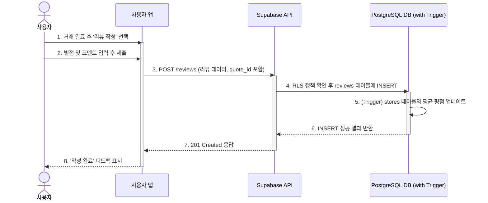

## 기능 명세서: 리뷰 및 평점

### 1. 기능 기본 정보

| 항목 | 내용 |
| :--- | :--- |
| **기능 ID** | `FE-COM-020` |
| **기능명** | 리뷰 및 평점 (Review & Rating) |
| **설명** | 실제 거래를 완료한 사용자가 해당 판매점에 대해 별점과 텍스트 후기를 남기는 기능입니다. 이 기능은 플랫폼의 신뢰도를 구축하고 다른 사용자의 구매 결정을 돕는 핵심적인 커뮤니티 요소입니다. |
| **관련 서비스** | -   **사용자 앱 (TBridge.Maui)**: 리뷰 작성 및 조회 UI 제공 -   **사업주 웹 포털 (TBridge.Web)**: 자신의 판매점에 대한 리뷰 확인 UI 제공 -   **백엔드 (Supabase)**: `reviews` 테이블에 리뷰 데이터 저장 및 평점 집계 |

### 2. 요구사항

#### 2.1. 사용자 스토리
> 다른 구매자에게 도움을 주고 싶은 **사용자로서**, 실제 거래를 완료한 판매점에 대해 별점과 후기를 남겨, 신뢰도 높은 판매점 정보를 구축하는 데 기여하고 싶다.

#### 2.2. 세부 요구사항 (기능 명세)

-   견적 채택 등 '거래 완료' 상태로 확인된 사용자에 한해서만 리뷰를 작성할 수 있는 권한이 부여되어야 한다.
-   리뷰 작성 시, 별점(1~5점)과 텍스트 코멘트를 입력할 수 있어야 한다.
-   제출된 리뷰는 해당 거래(`quote_id`) 및 판매점(`store_id`)과 명확히 연결되어야 한다.
-   모든 사용자는 판매점 상세 페이지에서 해당 판매점에 대한 전체 리뷰 목록과 평균 별점을 확인할 수 있어야 한다.
-   판매점주는 자신의 포털에서 자신의 판매점에 달린 모든 리뷰를 확인할 수 있어야 한다.

#### 2.3. 비기능적 요구사항

-   **데이터 무결성**: 하나의 거래(`quote_id`)에 대해서는 오직 하나의 리뷰만 작성될 수 있어야 한다. 이는 `reviews` 테이블의 `quote_id` 컬럼에 `UNIQUE` 제약 조건을 통해 보장되어야 한다.
-   **보안**: 리뷰 작성 시, 시스템은 현재 로그인한 사용자가 해당 거래의 실제 당사자인지 RLS 정책을 통해 검증해야 한다.
-   **성능**: 특정 판매점의 평균 평점 조회 시, 매번 전체 리뷰를 계산하는 대신 집계된 값을 조회하여 1초 이내에 응답해야 한다. (DB 트리거나 뷰 활용 권장)
-   **공정성**: 악의적이거나 조작된 리뷰를 관리자가 검토하고 숨김 처리할 수 있는 기능이 필요하다. (FE-ADM-030 연관)

### 3. 데이터 흐름

1.  **리뷰 작성 요청**: 거래를 완료한 사용자가 앱 내에서 '리뷰 작성하기' 버튼을 클릭합니다.
2.  **리뷰 제출**: 사용자가 별점과 코멘트를 입력한 후 '제출' 버튼을 누릅니다.
3.  **API 요청**: 클라이언트 앱은 리뷰 데이터(`rating`, `comment`)와 관련 ID(`store_id`, `quote_id`)를 포함하여 백엔드의 `POST /reviews` 엔드포인트로 API 요청을 보냅니다.
4.  **백엔드 처리 및 인가**: Supabase는 JWT로 사용자를 인증합니다. RLS 정책은 요청자가 해당 `quote_id`의 소유주가 맞는지, 그리고 해당 `quote_id`에 대해 이미 작성된 리뷰가 없는지 검증합니다.
5.  **데이터 저장**: 검증 통과 시, `reviews` 테이블에 새로운 리뷰 레코드를 `INSERT` 합니다.
6.  **평점 집계 (Trigger)**: `reviews` 테이블에 `INSERT`가 발생하면, 사전에 정의된 데이터베이스 트리거가 실행됩니다. 이 트리거는 해당 `store_id`의 평균 평점을 다시 계산하여 `stores` 테이블의 `average_rating`과 같은 집계 컬럼을 업데이트합니다.
7.  **성공 응답**: 백엔드는 `201 Created` 상태 코드를 클라이언트 앱에 반환합니다.
8.  **UI 업데이트**: 클라이언트 앱은 '리뷰 작성이 완료되었습니다' 메시지를 표시하고, 사용자의 '내가 쓴 리뷰' 목록을 갱신합니다.

#### Sequence Diagram

