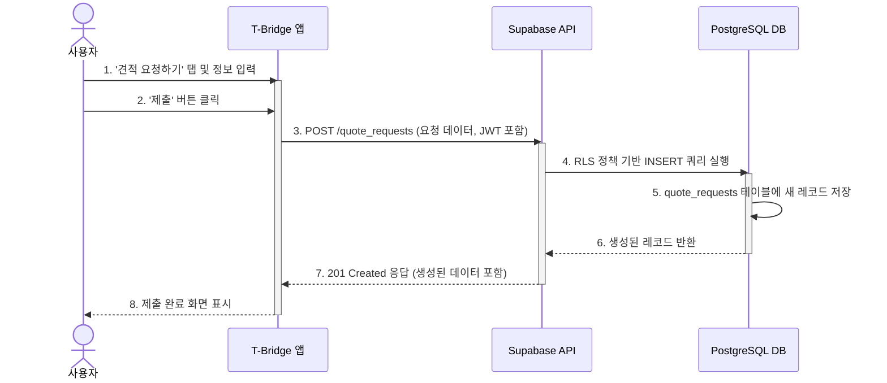

## 기능 명세서: 견적 요청

### 1. 기능 기본 정보

| 항목 | 내용 |
| :--- | :--- |
| **기능 ID** | `FE-QT-010` |
| **기능명** | 견적 요청 (Quote Request) |
| **설명** | 사용자가 개인정보 노출 없이 원하는 통신 상품(휴대폰, 인터넷 등)의 조건을 담은 요청서를 플랫폼에 제출하는 기능입니다. 이는 T-Bridge 서비스의 핵심 사용자 여정이 시작되는 첫 단계입니다. |
| **관련 서비스** | -   **사용자 앱 (TBridge.Maui)**: 사용자가 견적 요청 폼을 작성하고 제출하는 인터페이스 -   **백엔드 (Supabase)**: 제출된 요청 데이터를 저장하고 관리 |

### 2. 요구사항

#### 2.1. 사용자 스토리
> 통신사 영업 전화가 부담스러운 **사용자로서**, 개인정보 입력 없이 원하는 휴대폰/인터넷 견적을 요청하여, 스팸 걱정 없이 자유롭게 조건을 비교하고 싶다.

#### 2.2. 세부 요구사항 (기능 명세)

-   사용자는 견적 요청 시작 시 '휴대폰' 또는 '인터넷/IPTV' 중 상품 유형을 선택할 수 있어야 한다.
-   휴대폰 선택 시, 단말기 모델, 통신사(변경/기존 유지), 요금제 유형 등 필수 정보를 입력하는 폼이 제공되어야 한다.
-   견적 요청 단계에서는 어떠한 경우에도 사용자의 실명이나 전화번호를 수집해서는 안 된다.
-   '요청 제출' 버튼을 누르면, 입력된 내용은 `quote_requests` 테이블에 새로운 레코드로 저장되어야 한다.
-   요청 제출 완료 후, 사용자는 '내 요청 현황' 페이지로 이동하여 방금 제출한 요청이 '견적 수신 대기 중' 상태로 표시되는 것을 확인할 수 있어야 한다.

#### 2.3. 비기능적 요구사항

-   **보안**: 요청 데이터는 사용자의 JWT를 통해 인증된 후에만 제출될 수 있어야 한다. 제출된 `request_details` JSON 객체에 개인 식별 정보(PII)가 포함되지 않도록 클라이언트 및 서버 레벨에서 검증이 필요하다.
-   **성능**: 사용자가 '요청 제출' 버튼을 누른 후 1초 이내에 서버로부터 응답을 받아 처리 완료 피드백을 볼 수 있어야 한다.
-   **사용성**: 견적 요청 폼은 사용자가 최소한의 단계와 노력으로 완료할 수 있도록 직관적으로 설계되어야 한다.

### 3. 데이터 흐름

1.  **요청 시작**: 사용자가 T-Bridge 앱에서 '견적 요청하기' 버튼을 탭합니다.
2.  **폼 작성**: 앱은 사용자에게 요청서 작성 UI를 제공합니다. 사용자는 원하는 상품 유형, 단말기 모델 등 필요한 정보를 입력합니다.
3.  **데이터 전송**: 사용자가 '제출' 버튼을 누르면, 앱은 입력된 정보를 바탕으로 JSON 객체를 생성하고, 인증된 사용자의 JWT와 함께 백엔드(Supabase)의 `POST /quote_requests` 엔드포인트로 API 요청을 보냅니다.
4.  **백엔드 처리**: Supabase는 API 게이트웨이에서 JWT를 검증합니다. PostgREST는 요청을 받아 `quote_requests` 테이블에 `INSERT`를 시도합니다.
5.  **데이터베이스 저장**: RLS(행 수준 보안) 정책은 `INSERT` 권한을 확인하고, 요청을 보낸 사용자의 `auth.uid()`가 새 레코드의 `user_id`와 일치하는지 검증합니다. 검증 통과 시, 데이터베이스는 새로운 견적 요청 레코드를 저장합니다.
6.  **성공 응답**: 데이터베이스는 성공적으로 생성된 레코드 정보를 API에 반환하고, API는 `201 Created` 상태 코드와 함께 해당 데이터를 클라이언트 앱에 응답합니다.
7.  **UI 업데이트**: 클라이언트 앱은 성공 응답을 받은 후, 사용자에게 '요청이 성공적으로 제출되었습니다'와 같은 확인 메시지를 보여주고 '내 요청 현황' 페이지로 안내합니다.

#### Sequence Diagram

