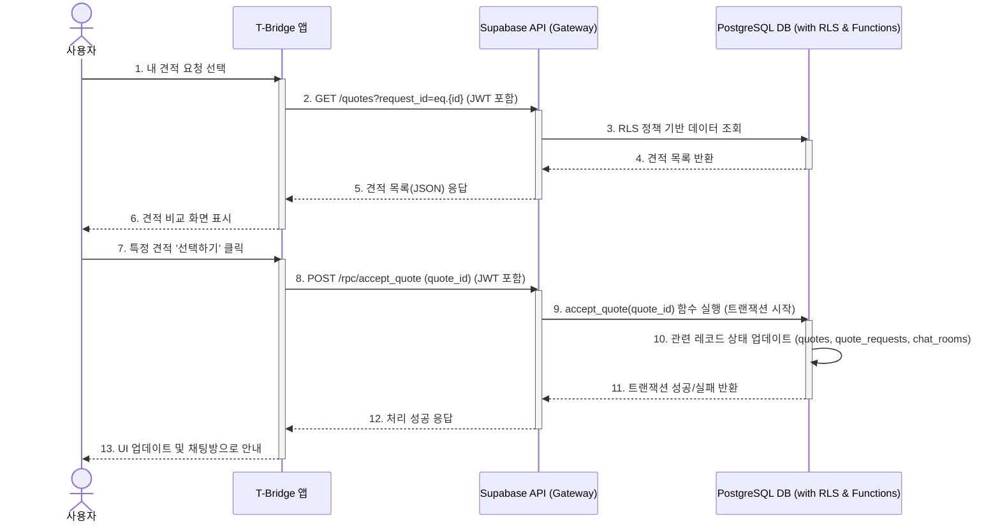

## 기능 명세서: 견적 비교 및 선택

### 1. 기능 기본 정보

| 항목         | 내용                                                                                                                                                                              |
| :--------- | :------------------------------------------------------------------------------------------------------------------------------------------------------------------------------ |
| **기능 ID**  | `FE-QT-020`                                                                                                                                                                     |
| **기능명**    | 견적 비교 및 선택 (Quote Comparison & Selection)                                                                                                                                       |
| **설명**     | 사용자가 견적 요청에 대해 여러 판매점으로부터 받은 견적들을 표준화된 형식의 UI에서 비교하고, 가장 유리한 조건을 제시한 견적을 최종적으로 선택하는 기능입니다.                                                                                      |
| **관련 서비스** | -   **사용자 앱 (TBridge.Maui)**: 사용자가 견적을 비교하고 선택하는 주 인터페이스 -   **사업주 웹 포털 (TBridge.Web)**: 비교 대상이 되는 견적을 제출하는 플랫폼 -   **백엔드 (Supabase)**: 견적 데이터 제공, 상태 업데이트, 알림 발송 등 로직 처리 |

### 2. 요구사항

#### 2.1. 사용자 스토리
> 복잡한 요금제가 어려운 **사용자로서**, 여러 판매점의 견적을 동일한 기준으로 정리된 화면에서 비교하여, 가장 경제적인 선택을 쉽게 하고 싶다.

#### 2.2. 세부 요구사항 (기능 명세)

-   사용자는 특정 견적 요청에 대해 수신된 모든 견적을 하나의 화면에서 목록으로 볼 수 있어야 한다.
-   각 견적은 '실질 할부원금', '월 예상 납부액', '총 소유 비용(TCO)' 등 표준화된 핵심 지표를 포함하여 표시되어야 한다.
-   사용자는 견적 목록을 다양한 기준(예: 낮은 가격순, 높은 할인순)으로 정렬할 수 있어야 한다.
-   사용자는 특정 견적을 '선택하기' 버튼을 눌러 최종 수락할 수 있다.
-   하나의 견적이 수락되면, 동일한 요청에 속한 다른 모든 견적들의 상태는 자동으로 '거절됨'으로 변경되어야 한다.
-   견적을 수락하면 해당 판매점과의 1:1 보안 채팅방이 자동으로 개설되거나, 개설할 수 있도록 안내되어야 한다.

#### 2.3. 비기능적 요구사항

-   **성능**: 10개 이상의 견적이 포함된 비교 화면은 2초 이내에 로딩되어야 한다.
-   **실시간성**: 사용자가 화면을 보고 있는 중에 새로운 견적이 도착하면, 실시간으로 목록이 업데이트되거나 알림이 표시되어야 한다.
-   **보안**: 사용자는 자신이 요청한 견적에 대한 응답만 조회할 수 있어야 하며, 이는 RLS(행 수준 보안) 정책으로 강제되어야 한다.
-   **사용성**: 모바일 화면에 최적화되어, 복잡한 정보(가격, 조건 등)를 직관적으로 비교할 수 있도록 UI가 설계되어야 한다.

### 3. 데이터 흐름

1.  **조회**: 사용자가 앱에서 특정 견적 요청을 선택하면, 클라이언트는 해당 `request_id`와 함께 백엔드(Supabase)에 견적 목록을 요청합니다.
2.  **인증 및 인가**: 백엔드는 요청 헤더의 JWT를 통해 사용자를 인증하고, RLS 정책을 통해 해당 사용자가 `request_id`의 소유자인지 검증합니다.
3.  **데이터 반환**: 검증이 완료되면, 백엔드는 `quotes` 테이블에서 해당 `request_id`를 가진 모든 레코드를 조회하여 클라이언트에 반환합니다.
4.  **선택**: 사용자가 특정 견적을 '선택하기' 버튼을 누르면, 클라이언트는 해당 `quote_id`를 백엔드의 '견적 수락' API(Postgres 함수)로 전송합니다.
5.  **트랜잭션 처리**: '견적 수락' 함수는 단일 트랜잭션 내에서 다음을 수행합니다.
    -   선택된 `quotes` 레코드의 `status`를 'accepted'로 변경합니다.
    -   동일한 `request_id`를 가진 나머지 `quotes` 레코드들의 `status`를 'rejected'로 변경합니다.
    -   원본 `quote_requests` 레코드의 `status`를 'closed'로 변경합니다.
    -   `chat_rooms` 테이블에 새로운 채팅방을 생성합니다.
6.  **결과 반영**: 트랜잭션 성공 응답을 받은 클라이언트는 UI를 '선택 완료' 상태로 변경하고, 사용자에게 채팅방으로 이동할 수 있도록 안내합니다.

#### Sequence Diagram

