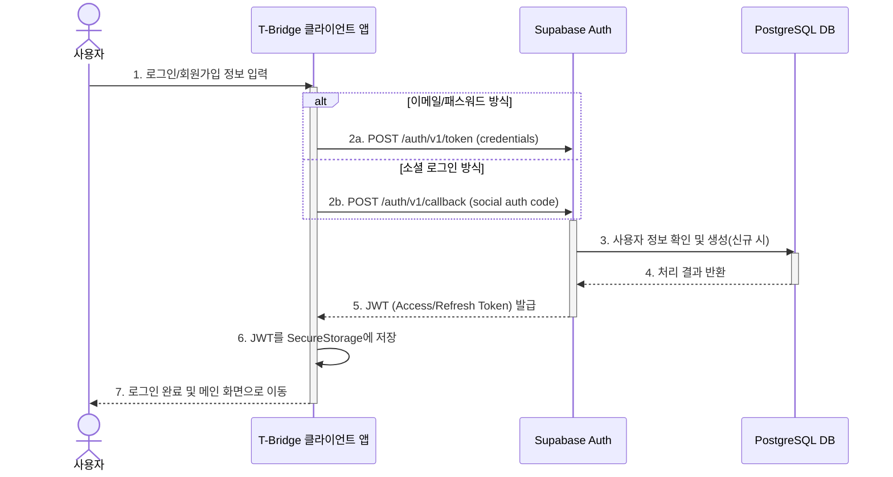

## 기능 명세서: 계정 및 인증

### 1. 기능 기본 정보

| 항목 | 내용 |
| :--- | :--- |
| **기능 ID** | `FE-USR-010` |
| **기능명** | 계정 및 인증 (Account & Authentication) |
| **설명** | 사용자가 T-Bridge 서비스를 이용하기 위해 계정을 생성하고, 로그인하여 자신의 신원을 증명하는 모든 과정을 포함합니다. 이메일/비밀번호 방식과 소셜 로그인을 지원합니다. |
| **관련 서비스** | -   **사용자 앱 (TBridge.Maui)**: 로그인 및 회원가입 UI 제공 -   **웹 포털 (TBridge.Web)**: 사업주 및 관리자 로그인 UI 제공 -   **백엔드 (Supabase Auth)**: 실제 인증 로직 및 사용자 세션 관리 수행 |

### 2. 요구사항

#### 2.1. 사용자 스토리
> T-Bridge를 처음 방문한 **예비 사용자로서**, 내가 선호하는 방식(이메일 또는 카카오)으로 쉽고 빠르게 가입하고 로그인하여, 서비스를 즉시 이용하고 싶다.

#### 2.2. 세부 요구사항 (기능 명세)

-   사용자는 이메일과 비밀번호를 입력하여 신규 계정을 생성할 수 있어야 한다.
-   사용자는 카카오 계정을 연동하여 간편하게 회원가입 및 로그인을 할 수 있어야 한다.
-   로그인에 성공하면, 클라이언트는 서버로부터 JWT(JSON Web Token)를 발급받아 안전하게 저장해야 한다.
-   로그아웃 시, 클라이언트에 저장된 JWT 및 모든 세션 정보는 안전하게 삭제되어야 한다.
-   신규 회원가입 시, Supabase의 `auth.users` 테이블과 연동되는 `public.profiles` 테이블에 해당 사용자의 레코드가 'user' 기본 역할로 생성되어야 한다.

#### 2.3. 비기능적 요구사항

-   **보안**: 비밀번호는 반드시 해싱(hashing)하여 저장해야 하며, 모든 인증 관련 통신은 HTTPS로 암호화되어야 한다. JWT는 적절한 만료 시간을 가져야 한다.
-   **성능**: 로그인 요청 후 2초 이내에 사용자 인증이 완료되고 피드백이 제공되어야 한다.
-   **안정성**: 인증 서비스는 99.9% 이상의 가용성을 보장해야 한다. (Supabase 서비스 수준에 따름)

### 3. 데이터 흐름

1.  **인증 요청**: 사용자가 앱에서 '로그인' 또는 '회원가입'을 선택하고, 이메일/비밀번호 또는 소셜 로그인(카카오) 방식을 선택합니다.
2.  **자격 증명 제출**: 클라이언트 앱은 사용자의 자격 증명을 받아 Supabase Auth 엔드포인트로 전송합니다.
3.  **서버 인증**: Supabase Auth는 제출된 정보를 검증합니다. 신규 사용자일 경우 `auth.users` 테이블에 사용자를 생성하고, 이와 연동된 트리거가 `public.profiles` 테이블에 프로필 정보를 생성합니다.
4.  **JWT 발급**: 인증에 성공하면, Supabase Auth는 해당 사용자에 대한 고유한 `access_token`과 `refresh_token`이 포함된 JWT를 생성하여 클라이언트 앱에 반환합니다.
5.  **토큰 저장**: 클라이언트 앱은 수신한 JWT를 `SecureStorage`와 같은 안전한 저장소에 보관합니다.
6.  **상태 변경**: 앱은 내부 상태를 '인증됨'으로 변경하고, 사용자를 메인 대시보드 또는 이전 페이지로 안내합니다.

#### Sequence Diagram

