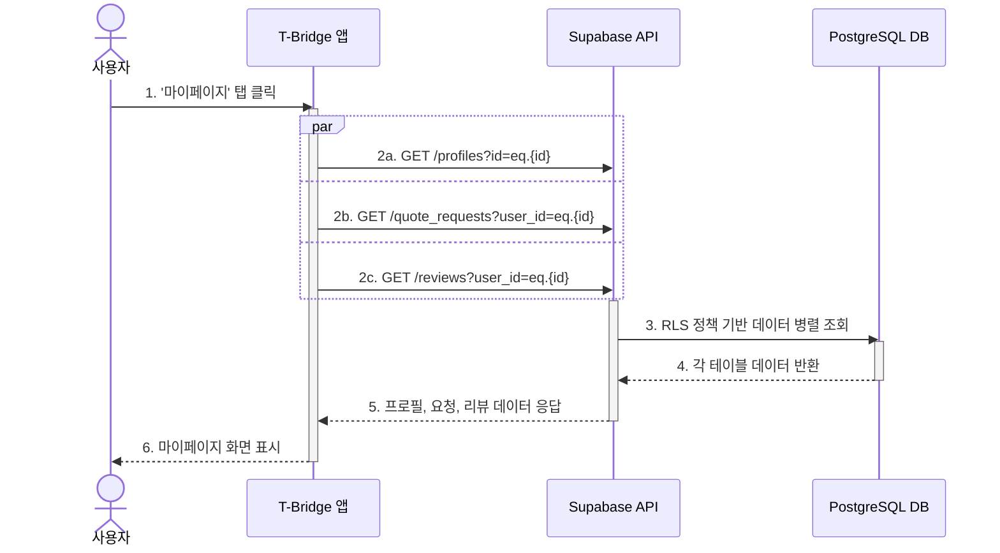

## 기능 명세서: 프로필 및 마이페이지

### 1. 기능 기본 정보

| 항목 | 내용 |
| :--- | :--- |
| **기능 ID** | `FE-USR-020` |
| **기능명** | 프로필 및 마이페이지 (Profile & My Page) |
| **설명** | 로그인한 사용자가 자신의 계정 정보, 서비스 이용 내역(견적, 리뷰 등)을 확인하고 관리할 수 있는 개인화된 공간입니다. 각종 설정 및 고객 지원 기능으로의 접근 지점 역할도 수행합니다. |
| **관련 서비스** | -   **사용자 앱 (TBridge.Maui)**: 마이페이지 UI 제공 및 사용자 상호작용 처리 -   **백엔드 (Supabase)**: 프로필, 견적 요청, 리뷰 등 사용자 관련 데이터 제공 및 업데이트 |

### 2. 요구사항

#### 2.1. 사용자 스토리
> T-Bridge를 이용하는 **회원으로서**, 나의 활동 내역(견적 요청, 리뷰 등)을 한 곳에서 모아보고 프로필 정보를 관리하여, 서비스를 개인화하고 편리하게 이용하고 싶다.

#### 2.2. 세부 요구사항 (기능 명세)

-   사용자는 마이페이지에서 자신의 프로필 정보(닉네임)를 조회하고 수정할 수 있어야 한다.
-   사용자는 자신이 요청했던 모든 견적 목록과 각 요청의 현재 상태(예: 견적 수신 중, 마감)를 확인할 수 있어야 한다.
-   사용자는 자신이 작성했던 모든 리뷰 목록을 조회하고 관리(수정/삭제)할 수 있어야 한다.
-   사용자는 자신이 '찜'한 관심 판매점 목록을 확인할 수 있어야 한다.
-   알림 설정, 공지사항, 고객센터 문의, 약관 정보 등 기타 메뉴로 이동할 수 있는 링크가 제공되어야 한다.

#### 2.3. 비기능적 요구사항

-   **보안**: 사용자는 오직 자신의 활동 내역만 조회하고 수정할 수 있어야 합니다. 모든 데이터 조회 API는 RLS 정책을 통해 사용자의 ID(`auth.uid()`)를 기준으로 필터링되어야 합니다.
-   **성능**: 마이페이지 진입 시, 관련된 모든 데이터(프로필, 요청 목록 등)는 2초 이내에 화면에 로드되어야 합니다.
-   **데이터 일관성**: 마이페이지에 표시되는 정보(예: 견적 요청 상태)는 데이터베이스의 실제 상태와 항상 일관성을 유지해야 합니다.

### 3. 데이터 흐름

1.  **화면 진입**: 인증된 사용자가 앱 하단 탭 바에서 '마이페이지' 아이콘을 탭합니다.
2.  **병렬 데이터 요청**: 클라이언트 앱은 마이페이지를 구성하는 데 필요한 여러 데이터를 백엔드(Supabase)에 병렬로 요청합니다. 각 요청에는 사용자의 JWT가 포함됩니다.
    -   `GET /profiles?id=eq.{내_ID}`: 내 프로필 정보 요청
    -   `GET /quote_requests?user_id=eq.{내_ID}`: 내 견적 요청 목록 요청
    -   `GET /reviews?user_id=eq.{내_ID}`: 내 리뷰 목록 요청
3.  **인가 및 데이터 조회**: Supabase는 각 요청의 JWT를 검증하고, RLS 정책에 따라 요청자가 데이터를 조회할 권한이 있는지 확인합니다. 권한이 확인되면, 각 테이블에서 해당 사용자의 데이터만 필터링하여 조회합니다.
4.  **데이터 응답**: 백엔드는 조회된 데이터를 각각의 JSON 배열 형태로 클라이언트 앱에 응답합니다.
5.  **UI 렌더링**: 클라이언트 앱은 수신한 데이터를 사용하여 마이페이지의 각 섹션(프로필, 견적 목록, 리뷰 목록 등)을 렌더링합니다.
6.  **(수정 시) 업데이트 요청**: 사용자가 닉네임을 수정하고 '저장' 버튼을 누르면, 클라이언트 앱은 변경된 데이터를 담아 `PATCH /profiles?id=eq.{내_ID}` API를 호출합니다.
7.  **업데이트 처리**: 백엔드는 RLS 정책을 통해 수정 권한을 확인한 후, `profiles` 테이블의 해당 레코드를 업데이트하고 성공 상태 코드를 반환합니다.
8.  **UI 갱신**: 클라이언트 앱은 성공 응답을 받고 UI의 닉네임을 새로운 값으로 갱신합니다.

#### Sequence Diagram

