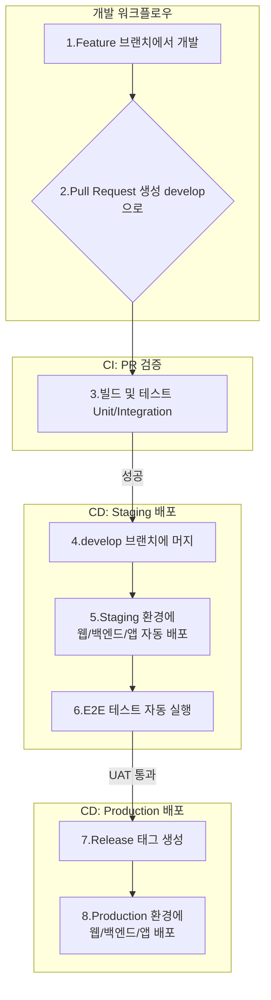

## T-Bridge 구성 요소별 배포 전략

본 문서는 T-Bridge 서비스를 구성하는 각 애플리케이션과 백엔드 리소스를 개발, 스테이징, 프로덕션 환경에 안정적이고 자동화된 방식으로 배포하기 위한 전략을 정의합니다.

---

### 1. 배포 환경 구성

안정적인 개발 및 운영을 위해 역할을 분리한 3단계 환경을 구성합니다.

| 환경 (Environment) | 목적 | 구성 방안 |
| :--- | :--- | :--- |
| **개발 (Development)** | 기능 개발 및 단위/통합 테스트 | -   **로컬 환경**: 개발자 PC의 Docker를 이용한 로컬 Supabase + Visual Studio/VS Code -   **공용 개발 DB**: 모든 개발자가 공유하는 개발용 Supabase 프로젝트 |
| **스테이징 (Staging)** | 프로덕션과 동일한 환경에서 최종 테스트(E2E, UAT) 수행 | -   프로덕션과 거의 동일한 사양의 전용 Supabase 프로젝트 및 Azure App Service 리소스 -   QA팀 및 UAT 참여자가 접근하여 기능 검증 |
| **프로덕션 (Production)**| 실제 사용자가 서비스를 이용하는 라이브 환경 | -   최종 사용자를 위한 전용 Supabase 프로젝트 및 Azure App Service 리소스 -   가용성과 성능을 고려한 리소스 구성 |

### 2. 구성 요소별 배포 전략

#### 2.1. 백엔드 (Supabase: DB 스키마 및 엣지 함수)
-   **배포 도구**: Supabase CLI
-   **배포 단위**: SQL 마이그레이션 파일, 엣지 함수(TypeScript) 코드
-   **프로세스**:
    1.  개발자는 로컬 환경에서 스키마를 변경하고 `supabase db diff` 명령으로 마이그레이션 SQL 파일을 생성합니다.
    2.  CI/CD 파이프라인(GitHub Actions)은 Git에 푸시된 신규 마이그레이션 파일을 감지합니다.
    3.  파이프라인은 대상 환경(스테이징/프로덕션)의 Supabase 프로젝트에 `supabase db push` 및 `supabase functions deploy` 명령을 실행하여 변경사항을 안전하게 적용합니다.

#### 2.2. 웹 애플리케이션 (사업주/관리자 포털)
-   **배포 대상**: Azure App Service
-   **배포 도구**: GitHub Actions (`azure/webapps-deploy@v2` 액션 활용)
-   **프로세스**:
    1.  `TBridge.Web` 프로젝트의 소스 코드가 `develop`(스테이징용) 또는 `main`(프로덕션용) 브랜치에 병합됩니다.
    2.  CI/CD 파이프라인은 `dotnet publish` 명령으로 Blazor Web App을 빌드합니다.
    3.  빌드된 아티팩트를 대상 환경(스테이징/프로덕션)의 Azure App Service에 배포합니다. 이때, Supabase 접속 정보 등 민감 정보는 GitHub Secrets를 통해 환경 변수로 주입합니다.

#### 2.3. 클라이언트 애플리케이션 (사용자 앱 - .NET MAUI)
-   **배포 대상**: Apple App Store, Google Play Store
-   **배포 도구**: GitHub Actions (iOS 빌드를 위해 `macos-latest` 실행기 사용)
-   **프로세스**:
    1.  **내부 테스트 (Staging)**: `develop` 브랜치에 변경사항이 병합되면, CI/CD 파이프라인이 Ad-hoc 인증서로 서명된 앱 패키지(`.ipa`, `.aab`)를 빌드합니다. 빌드된 앱은 Apple TestFlight와 Google Play 내부 테스트 트랙에 자동으로 업로드되어 QA 및 UAT를 진행합니다.
    2.  **프로덕션 출시 (Production)**: UAT가 완료된 후, `main` 브랜치 또는 릴리즈 태그를 기반으로 프로덕션용 인증서로 서명된 앱을 빌드합니다. 이 앱 패키지는 각 앱 스토어에 **수동으로 제출**하여 최종 검토를 거쳐 사용자에게 배포됩니다. (스토어 정책상 완전 자동 배포는 지양)
    3.  **인증서 관리**: 앱 서명에 필요한 모든 인증서와 키는 GitHub Actions Secrets에 안전하게 저장하여 관리합니다.

### 3. 배포 파이프라인 (CI/CD)

**GitHub Actions**를 사용하여 아래와 같은 파이프라인을 구성합니다.

### 4. 롤백 및 모니터링 계획

| 구분                    | 계획                                                                                                                                                                                                                                                                                                                                 |
| :-------------------- | :--------------------------------------------------------------------------------------------------------------------------------------------------------------------------------------------------------------------------------------------------------------------------------------------------------------------------------- |
| **롤백 (Rollback)**     | - **웹 애플리케이션**: Azure App Service의 '배포 슬롯' 기능을 이용한 Blue-Green 배포를 고려하거나, 문제가 발생한 경우 이전의 안정적인 버전을 GitHub Actions를 통해 재배포합니다. - **데이터베이스**: `supabase`의 정책에 따라 직접적인 롤백 대신, 문제를 해결하는 새로운 마이그레이션 파일을 작성하여 적용하는 **롤 포워드(Roll-forward)** 방식을 사용합니다. - **클라이언트 앱**: 스토어 정책상 롤백이 불가능하므로, 긴급한 버그 수정 버전을 최대한 빠르게 빌드하여 재심사 및 배포를 진행합니다. |
| **모니터링 (Monitoring)** | - **웹 애플리케이션**: **Azure Application Insights**를 사용하여 실시간 성능, 예외 및 로그를 모니터링합니다. - **백엔드**: **Supabase Dashboard**를 통해 API 트래픽, 데이터베이스 상태, 함수 실행 로그를 확인합니다. - **클라이언트 앱**: **Firebase Crashlytics** 또는 **Sentry**와 같은 크래시 리포팅 도구를 통합하여 실제 사용자 환경에서 발생하는 오류를 수집하고 분석합니다.                                                        |
