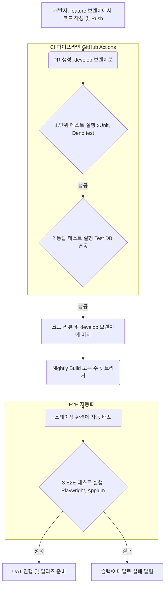

## T-Bridge 품질 보증(QA) 및 테스트 전략

본 문서는 T-Bridge 서비스의 안정성과 품질을 보장하기 위한 종합적인 테스트 전략을 정의합니다. 각 테스트 단계별 목적, 도구, 담당 주체를 명확히 하여, 개발 생명주기 전반에 걸쳐 체계적인 품질 관리를 수행하는 것을 목표로 합니다.

---

### 테스트 종류별 전략

| 테스트 종류 | 목적 | 사용할 도구 | 담당 주체 |
| :--- | :--- | :--- | :--- |
| **단위 테스트 (Unit Test)** | **코드의 최소 단위(메서드, 함수, 컴포넌트)를 개별적으로 검증**하여 로직의 정확성을 보장합니다. 의존성은 Mock 객체로 대체하여 격리된 환경에서 테스트합니다. | **- .NET (C#):** xUnit (테스트 프레임워크), bUnit (Blazor 컴포넌트), Moq (모킹 라이브러리) **- Edge Functions (TypeScript):** Deno 내장 테스트 러너, `std/assert` | **개발자** |
| **통합 테스트 (Integration Test)** | **여러 컴포넌트 또는 서비스가 함께 동작하는 것을 검증**합니다. 특히 T-Bridge의 BaaS 아키텍처에서 .NET 클라이언트 코드와 Supabase 백엔드(DB, Auth) 간의 연동을 중점적으로 테스트합니다. | **- .NET (C#):** xUnit, `WebAppFactory` **- 데이터베이스:** 로컬 Docker 기반 Supabase 또는 전용 테스트용 Supabase 프로젝트 | **개발자** |
| **E2E 테스트 (End-to-End Test)** | **실제 사용자 시나리오를 처음부터 끝까지 자동화하여 검증**합니다. 사용자 인터페이스(UI)부터 백엔드 시스템, 데이터베이스까지 전체 애플리케이션 흐름의 무결성을 보장합니다. | **- 사용자 앱 (MAUI):** Appium **- 웹 포털 (Blazor Web App):** Playwright | **QA 엔지니어** |
| **사용자 수용 테스트 (UAT)** | **최종 사용자의 관점에서 서비스가 비즈니스 요구사항을 충족하는지 검증**합니다. 출시 전 마지막 단계에서 실제 사용 환경과 동일한 스테이징 환경에서 수동으로 진행됩니다. | - 스테이징(Staging) 환경 - 테스트 시나리오 문서 | **기획자(PO/PM), 내부 테스터, 베타 유저 그룹** |

### 테스트 자동화 및 지속적인 통합(CI) 연동 계획

모든 자동화된 테스트는 **GitHub Actions** 기반의 CI 파이프라인에 통합하여, 코드 변경 시 품질을 지속적으로 검증합니다.

**CI/CD 파이프라인 내 테스트 실행 계획:**

1.  **Pull Request 생성 시 (대상: `develop` 브랜치)**
    -   `[필수 통과]` **단위 테스트**: 프로젝트의 모든 단위 테스트를 실행합니다. 실패 시 PR 머지를 차단합니다.
    -   `[필수 통과]` **통합 테스트**: 테스트용 Supabase 인스턴스에 연결하여 모든 통합 테스트를 실행합니다. 실패 시 PR 머지를 차단합니다.

2.  **`develop` 브랜치에 머지된 후 (Nightly 또는 수동)**
    -   `[배포]` 코드를 스테이징(Staging) 환경에 자동으로 배포합니다.
    -   `[모니터링]` 배포가 완료된 스테이징 환경을 대상으로 전체 **E2E 테스트** 스위트를 실행합니다. 테스트 실패 시, 관련 담당자에게 슬랙(Slack) 등을 통해 즉시 알림을 보냅니다.

3.  **릴리즈 준비**
    -   스테이징 환경에서 자동화된 E2E 테스트가 모두 통과된 후, 기획자 및 최종 사용자 그룹이 **UAT**를 진행합니다.
    -   UAT에서 모든 요구사항이 충족되었음이 확인되면, 해당 커밋을 기준으로 릴리즈(Release)를 생성하고 프로덕션에 배포합니다.