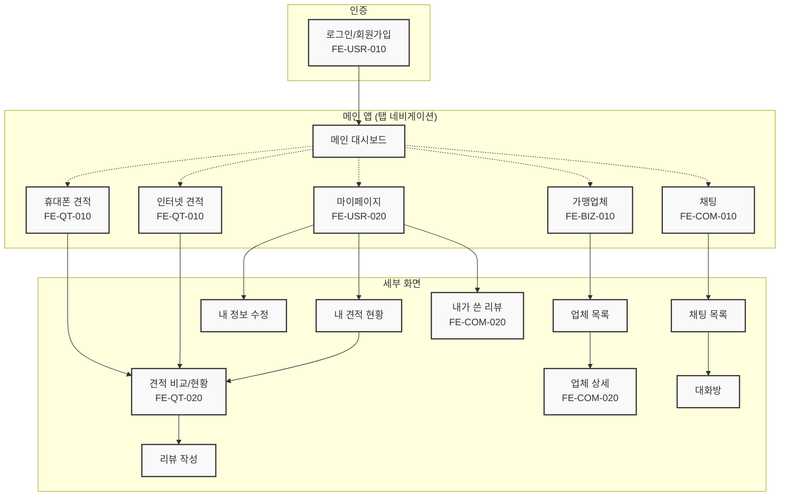
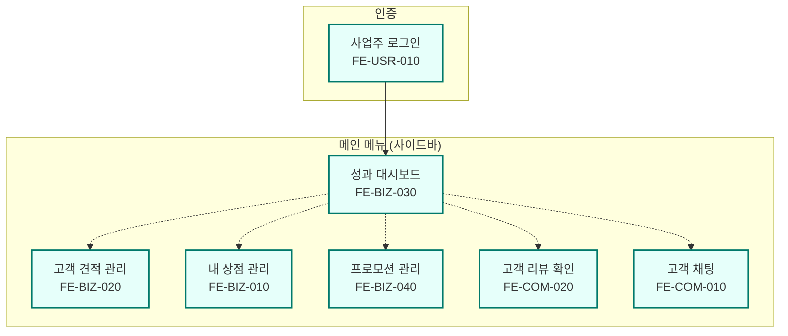
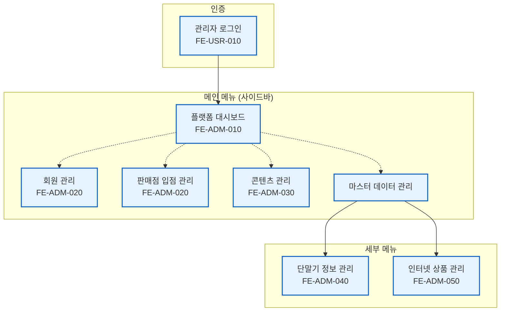

## T-Bridge 화면 흐름도

본 문서는 T-Bridge 플랫폼을 구성하는 각 애플리케이션의 주요 화면 구조 및 네비게이션 흐름을 시각적으로 표현한 다이어그램입니다. 와이어프레임 및 프로토타입 설계의 기반 자료로 활용됩니다.

---

### 1. 사용자 앱 (End-User App) 화면 흐름도

사용자가 서비스를 처음 접하고, 견적을 요청하며, 마이페이지를 이용하기까지의 핵심적인 화면 흐름을 나타냅니다.

### 2. 사업주 포털 (Business Owner Portal) 화면 흐름도

사업주가 로그인 후 자신의 상점 정보, 고객 요청, 성과 등을 관리하는 화면의 구조를 나타냅니다.

### 3. 최고 관리자 포털 (Admin Portal) 화면 흐름도

최고 관리자가 플랫폼의 모든 데이터를 모니터링하고 정책을 관리하는 화면의 구조를 나타냅니다.

