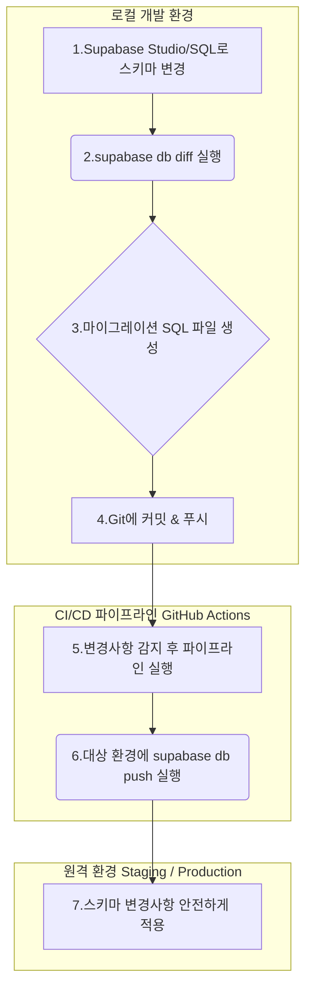

## 데이터베이스 스키마 마이그레이션 관리 방안

본 문서는 T-Bridge 프로젝트의 데이터베이스 스키마 변경 사항을 체계적이고 안전하게 관리하기 위한 마이그레이션 방안을 정의합니다.

### 1. 마이그레이션 도구 선정

- **선정 도구:** **Supabase CLI**

- **선택 이유:**
    1.  **공식 지원 및 생태계 통합**: Supabase CLI는 Supabase 프로젝트 관리를 위한 공식 도구로, 데이터베이스 스키마뿐만 아니라 RLS(행 수준 보안) 정책, 저장소(Storage), 엣지 함수(Edge Function) 등 Supabase 생태계 전반과 완벽하게 통합됩니다.
    2.  **SQL-First 접근 방식**: 모든 스키마 변경 사항을 SQL 파일로 관리하므로, DDL과 RLS 정책을 명시적으로 버전 관리(Git)할 수 있습니다. 이는 ORM의 추상화된 마이그레이션 방식보다 직관적이며, PostgreSQL의 네이티브 기능을 최대한 활용하는 T-Bridge 프로젝트의 방향성과 일치합니다.
    3.  **로컬 개발 환경 지원**: 로컬 Supabase 환경(Docker 기반)과의 연동을 지원하여, 개발자가 원격 데이터베이스에 영향을 주지 않고 안전하게 스키마를 변경하고 테스트할 수 있는 환경을 제공합니다.

### 2. 마이그레이션 관리 프로세스

개발 환경에서 발생한 스키마 변경을 스테이징 및 프로덕션 환경에 안전하게 배포하기 위해 다음 프로세스를 따릅니다.

**단계별 설명:**

1.  **초기 설정 (최초 1회)**
    - 개발자는 로컬 환경에 Supabase CLI를 설치하고 `supabase login` 명령으로 인증합니다.
    - Git 리포지토리 루트에서 `supabase init`으로 프로젝트를 초기화하고, `supabase link` 명령으로 원격 개발 DB와 연결합니다.
    - `supabase db pull` 명령을 실행하여 현재 원격 DB의 스키마를 로컬 마이그레이션 파일로 가져옵니다.

2.  **[개발] 스키마 변경 작업**
    - 개발자는 로컬 Supabase Studio 또는 DBeaver와 같은 툴을 사용하여 로컬 DB의 스키마를 변경합니다(예: `stores` 테이블에 `phone_number` 컬럼 추가).

3.  **[개발] 마이그레이션 파일 생성**
    - 스키마 변경 후, 터미널에서 `supabase db diff -f add_phone_to_stores` 와 같은 명령을 실행합니다.
    - 이 명령은 로컬 DB와 마지막 마이그레이션 상태를 비교하여 변경된 내용(`ALTER TABLE ...`)이 포함된 SQL 파일을 `/supabase/migrations` 디렉터리에 자동으로 생성합니다.

4.  **[개발] 코드 리뷰 및 커밋**
    - 생성된 마이그레이션 SQL 파일의 내용을 검토하고, 이상이 없으면 Git에 커밋(commit)하고 원격 저장소에 푸시(push)합니다.

5.  **[CI/CD] 자동 배포**
    - Git 푸시를 트리거로 GitHub Actions와 같은 CI/CD 파이프라인이 실행됩니다.
    - 파이프라인은 먼저 스테이징(Staging) 환경에 접속하여 `supabase db push` 명령을 실행합니다.
    - 이 명령은 아직 적용되지 않은 모든 신규 마이그레이션 파일을 순서대로 스테이징 DB에 적용합니다.

6.  **프로덕션 배포**
    - 스테이징 환경에서 변경사항이 성공적으로 검증되면, 동일한 방식으로 프로덕션(Production) 환경에 배포합니다. 이 과정은 수동 승인을 거치도록 설정할 수 있습니다.

### 3. 주요 명령어 사용 예시

| 목적 | 명령어 | 설명 |
| :--- | :--- | :--- |
| **프로젝트 초기화** | `supabase init` | 현재 디렉터리에 `/supabase` 폴더를 생성합니다. |
| **원격 DB 연결** | `supabase link --project-ref <프로젝트_ID>` | 로컬 프로젝트를 원격 Supabase 프로젝트에 연결합니다. |
| **마이그레이션 파일 생성** | `supabase db diff -f <마이그레이션_이름>` | 로컬 DB의 변경사항으로 신규 마이그레이션 SQL 파일을 생성합니다. |
| **원격 DB에 적용** | `supabase db push` | 로컬의 신규 마이그레이션들을 원격 DB에 적용합니다. (CI/CD에서 사용) |
| **로컬 DB 리셋** | `supabase db reset` | 로컬 DB를 초기화하고 모든 마이그레이션을 처음부터 다시 적용합니다. |
| **원격 DB 스키마 가져오기**| `supabase db pull` | 원격 DB의 전체 스키마를 로컬 파일로 가져옵니다. (초기 설정 시 사용) |

### 4. 롤백(Rollback) 정책

Supabase CLI는 Flyway나 Liquibase와 달리 마이그레이션을 되돌리는 `down` 또는 `rollback` 명령을 직접 지원하지 않습니다. 대신 **롤 포워드(Roll-forward)** 방식을 채택합니다.

- **절차**: 문제가 발생한 마이그레이션을 되돌려야 할 경우, 해당 변경사항을 취소하는 **새로운 마이그레이션 파일을 작성**하여 적용합니다.
- **예시**: `ADD COLUMN phone_number` 마이그레이션에 문제가 생겼다면, `DROP COLUMN phone_number` 내용을 담은 신규 마이그레이션 파일을 생성하고 `supabase db push`를 실행하여 롤백 효과를 얻습니다.
- **이유**: 이 방식은 데이터베이스의 변경 이력을 항상 선형적으로 유지하여 혼란을 방지하고, 모든 변경이 명시적인 마이그레이션 파일을 통해 추적되도록 보장합니다.