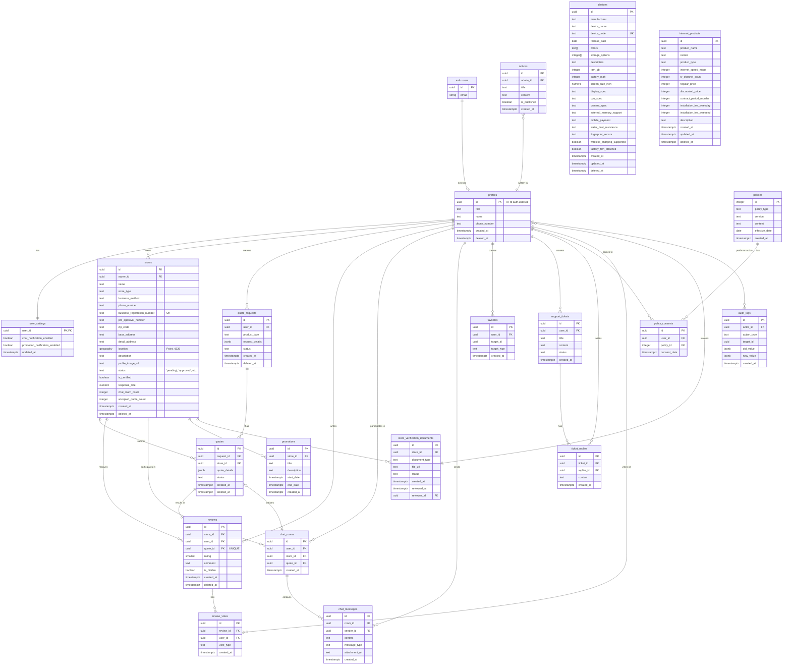

## T-Bridge 데이터베이스 ERD (Entity-Relationship Diagram)

본 문서는 `데이터베이스모델링.md`에 정의된 DDL 스키마를 바탕으로 T-Bridge 시스템의 데이터베이스 구조를 시각화한 ERD를 제공합니다. 각 테이블(엔티티)과 그들 간의 관계를 명확히 표현하여 데이터 구조에 대한 직관적인 이해를 돕습니다.

### Mermaid ERD

### 관계 설명 (Relationship Description)

1.  **auth.users 1:1 profiles**: Supabase의 기본 `users` 테이블은 `profiles` 테이블로 확장됩니다.
2.  **profiles 1:1 user_settings**: 하나의 `profile`은 하나의 `user_settings`를 가집니다.
3.  **profiles 1:N stores**: 하나의 `profile`('owner' 역할)은 여러 `store`를 소유할 수 있습니다.
4.  **stores 1:N store_verification_documents**: 하나의 `store`는 여러 `store_verification_document`를 가질 수 있습니다 (예: 사업자등록증, 통신판매업신고증).
5.  **stores 1:N promotions**: 하나의 `store`는 여러 `promotion`을 생성할 수 있습니다.
6.  **profiles 1:N quote_requests**: 하나의 `profile`('user' 역할)은 여러 `quote_request`를 생성할 수 있습니다.
7.  **quote_requests 1:N quotes**: 하나의 `quote_request`에 대해 여러 `store`가 `quote`를 제출할 수 있습니다.
8.  **stores 1:N quotes**: 하나의 `store`는 여러 `quote`를 제출할 수 있습니다.
9.  **quotes 1:1 reviews**: 하나의 성사된 `quote`에 대해서는 하나의 `review`만 작성될 수 있습니다.
10. **reviews 1:N review_votes**: 하나의 `review`는 여러 사용자로부터 `review_vote`(좋아요/싫어요)를 받을 수 있습니다.
11. **profiles 1:N favorites**: 하나의 `profile`은 여러 `favorite`(찜) 항목을 가질 수 있습니다.
12. **chat_rooms 1:N chat_messages**: 하나의 `chat_room`은 여러 `chat_message`를 포함합니다.
13. **notices, policies, support_tickets**: 관리자/사용자가 생성하는 독립적인 정보 테이블들과의 관계를 정의합니다.
14. **audit_logs**: 관리자 및 시스템의 주요 활동을 기록하며, `profiles` 테이블을 참조하여 행위자를 식별합니다.