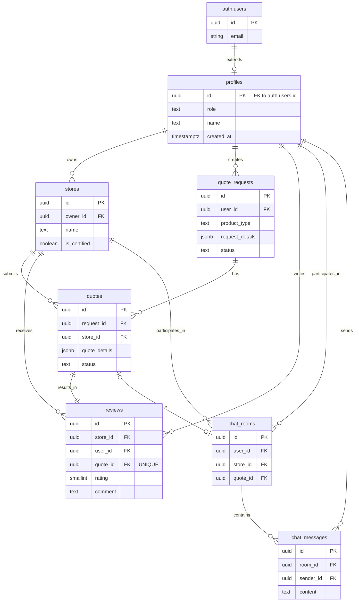

## T-Bridge 데이터베이스 ERD (Entity-Relationship Diagram)

본 문서는 `데이터베이스모델링.md`에 정의된 DDL 스키마를 바탕으로 T-Bridge 시스템의 데이터베이스 구조를 시각화한 ERD를 제공합니다. 각 테이블(엔티티)과 그들 간의 관계를 명확히 표현하여 데이터 구조에 대한 직관적인 이해를 돕습니다.

### Mermaid ERD

### 관계 설명 (Relationship Description)

1.  **auth.users 1:1 profiles**: Supabase의 기본 `users` 테이블은 `profiles` 테이블로 확장됩니다. 모든 `profile`은 정확히 하나의 `user`에 속합니다.
2.  **profiles 1:N stores**: 하나의 `profile`('owner' 역할)은 여러 개의 `store`(판매점)를 소유할 수 있습니다.
3.  **profiles 1:N quote_requests**: 하나의 `profile`('user' 역할)은 여러 개의 `quote_request`(견적 요청)를 생성할 수 있습니다.
4.  **quote_requests 1:N quotes**: 하나의 `quote_request`에 대해 여러 `store`가 `quote`(견적)를 제출할 수 있습니다.
5.  **stores 1:N quotes**: 하나의 `store`는 여러 `quote`를 제출할 수 있습니다.
6.  **quotes 1:1 reviews**: 하나의 성사된 `quote`(거래)에 대해서는 하나의 `review`만 작성될 수 있습니다. (`reviews.quote_id`는 UNIQUE 제약 조건)
7.  **profiles 1:N reviews**: 하나의 `profile`은 여러 `review`를 작성할 수 있습니다.
8.  **stores 1:N reviews**: 하나의 `store`는 여러 `review`를 받을 수 있습니다.
9.  **chat_rooms 1:N chat_messages**: 하나의 `chat_room`은 여러 개의 `chat_message`를 포함합니다.
10. **profiles, stores, quotes 와 chat_rooms 관계**:
    * `chat_room`은 반드시 하나의 `profile`(사용자)과 하나의 `store`(판매점)를 가집니다.
    * `chat_room`은 선택적으로 하나의 `quote`에서 시작될 수 있습니다.