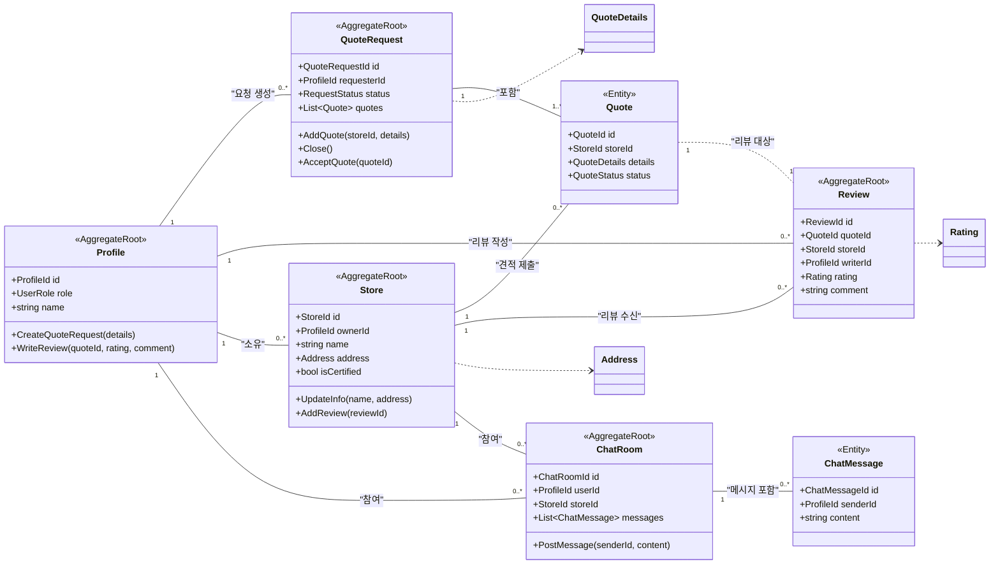

## T-Bridge 핵심 도메인 모델

본 문서는 T-Bridge 서비스의 핵심 도메인을 도메인 주도 설계(DDD) 관점에서 분석하고, 주요 애그리거트(Aggregate)와 그 구성요소를 정의합니다. 각 애그리거트는 데이터 일관성을 유지하는 트랜잭션의 단위이며, 루트(Root) 엔티티를 통해서만 접근하고 제어할 수 있습니다.

### 도메인 모델 클래스 다이어그램

---

### 애그리거트(Aggregate) 정의

#### 1. 사용자(User) 애그리거트
-   **설명**: 시스템의 모든 행위 주체인 사용자를 정의합니다. 사용자의 역할에 따라 다른 애그리거트를 생성하는 시작점 역할을 합니다.
-   **애그리거트 루트 (Root)**: **`Profile`**
    -   **엔티티 (Entities)**:
        -   **`Profile`**: 사용자의 고유 식별자와 역할을 가집니다.
            -   **속성**: `ProfileId id`, `UserRole role`, `string name`
            -   **핵심 행위**: `CreateQuoteRequest()`: 새로운 견적 요청을 생성합니다. `WriteReview()`: 완료된 거래에 대해 리뷰를 작성합니다. `RegisterStore()`: 사업자(owner) 역할일 경우, 자신의 판매점을 등록합니다.
    -   **값 객체 (Value Objects)**:
        -   `UserRole`: 사용자의 역할을 정의하는 열거형(Enum) 객체 (`USER`, `OWNER`, `ADMIN`).

#### 2. 견적(Quoting) 애그리거트
-   **설명**: 사용자의 견적 요청부터 판매점의 견적 제출, 그리고 최종 선택까지 이어지는 핵심 비즈니스 프로세스를 캡슐화합니다.
-   **애그리거트 루트 (Root)**: **`QuoteRequest`**
    -   **엔티티 (Entities)**:
        -   **`QuoteRequest`**: 하나의 견적 요청 트랜잭션 전체의 생명주기와 일관성을 관리합니다.
            -   **속성**: `QuoteRequestId id`, `ProfileId requesterId`, `RequestStatus status`, `List<Quote> quotes`
            -   **핵심 행위**: `AddQuote(storeId, details)`: 판매점으로부터 새로운 견적을 추가합니다. 견적 총 개수 제한과 같은 비즈니스 규칙을 검증합니다. `AcceptQuote(quoteId)`: 제출된 견적 중 하나를 최종 수락하고, 나머지 견적은 거절 처리하며 요청을 마감합니다.
        -   **`Quote`**: 개별 판매점이 제출한 견적 정보를 담습니다. `QuoteRequest` 내에서만 관리됩니다.
            -   **속성**: `QuoteId id`, `StoreId storeId`, `QuoteDetails details`, `QuoteStatus status`
            -   **핵심 행위**: `Accept()`: 자신의 상태를 '수락됨'으로 변경합니다.
    -   **값 객체 (Value Objects)**:
        -   `QuoteDetails`: 출고가, 지원금, 월 요금 등 표준화된 견적 상세 정보를 포함하는 불변 객체.
        -   `RequestStatus`, `QuoteStatus`: 요청과 견적의 상태를 나타내는 열거형 객체.

#### 3. 판매점(Store) 애그리거트
-   **설명**: 플랫폼에 입점한 개별 판매점의 정보와 상태를 관리합니다.
-   **애그리거트 루트 (Root)**: **`Store`**
    -   **엔티티 (Entities)**:
        -   **`Store`**: 판매점의 고유 정보와 비즈니스 규칙을 관리합니다.
            -   **속성**: `StoreId id`, `ProfileId ownerId`, `string name`, `Address address`, `bool isCertified`
            -   **핵심 행위**: `UpdateInfo()`: 판매점의 이름, 주소 등 정보를 수정합니다. `Certify()`: 관리자에 의해 '인증 성지'로 상태를 변경합니다. `AddReview(reviewId)`: 해당 상점에 대한 리뷰 ID를 추가하고 평균 평점을 갱신합니다.
    -   **값 객체 (Value Objects)**:
        -   `Address`: 판매점의 주소 정보를 담는 객체.

#### 4. 리뷰(Review) 애그리거트
-   **설명**: 완료된 거래(견적)에 대해 작성된 리뷰를 독립적인 단위로 관리합니다. 생성된 이후에는 거의 변경되지 않는 특성을 가집니다.
-   **애그리거트 루트 (Root)**: **`Review`**
    -   **엔티티 (Entities)**:
        -   **`Review`**: 리뷰의 모든 정보를 포함하며 일관성을 책임집니다.
            -   **속성**: `ReviewId id`, `QuoteId quoteId`, `StoreId storeId`, `ProfileId writerId`, `Rating rating`, `string comment`
            -   **핵심 행위**: `EditComment(newComment)`: (정책에 따라) 리뷰 내용을 수정할 수 있습니다.
    -   **값 객체 (Value Objects)**:
        -   `Rating`: 1~5점 사이의 별점을 나타내며, 생성 시 유효성 검사를 수행합니다.

#### 5. 채팅(Chat) 애그리거트
-   **설명**: 사용자와 판매점 간의 1:1 대화의 일관성을 보장합니다.
-   **애그리거트 루트 (Root)**: **`ChatRoom`**
    -   **엔티티 (Entities)**:
        -   **`ChatRoom`**: 두 참여자 간의 대화 세션 전체를 관리합니다.
            -   **속성**: `ChatRoomId id`, `ProfileId userId`, `StoreId storeId`, `List<ChatMessage> messages`
            -   **핵심 행위**: `PostMessage(senderId, content)`: 채팅방에 새로운 메시지를 추가합니다. 메시지 전송 전 참여자가 맞는지 등의 규칙을 검증할 수 있습니다.
        -   **`ChatMessage`**: 채팅방 내의 개별 메시지. `ChatRoom`을 통해서만 생성됩니다.
            -   **속성**: `ChatMessageId id`, `ProfileId senderId`, `string content`