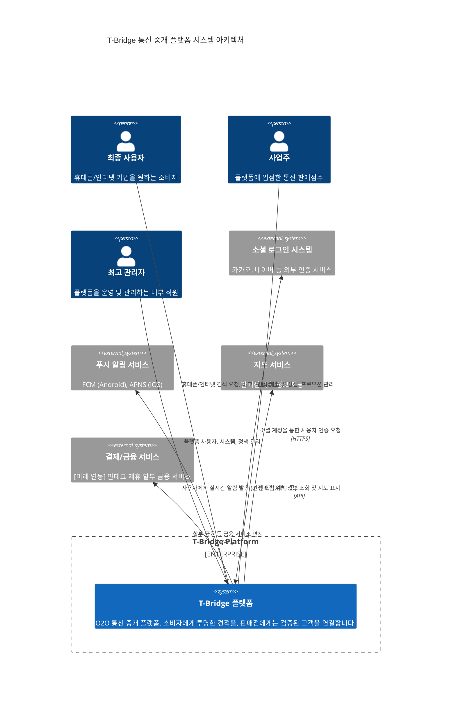

## T-Bridge 시스템 아키텍처 (System Architecture)

본 문서는 T-Bridge 플랫폼의 시스템 아키텍처를 C4 모델의 컨텍스트 다이어그램(Context Diagram)을 사용하여 기술합니다. 이 다이어그램은 T-Bridge 시스템과 상호작용하는 주요 사용자(Actors) 및 외부 시스템과의 관계를 최상위 수준에서 보여줍니다.

### 시스템 컨텍스트 다이어그램 (C4 Context Diagram)

### 구성 요소 설명

1.  **주요 사용자 (Actors)**
    * **최종 사용자 (End-User):** 서비스를 이용하여 통신 상품 견적을 받고, 판매점과 상담 후 계약을 진행하는 핵심 사용자입니다.
    * **사업주 (Business Owner):** 플랫폼에 자신의 상품을 등록하고, 고객의 요청에 견적을 보내며, 매장을 관리하는 공급자입니다.
    * **최고 관리자 (Admin):** 플랫폼의 전반적인 운영을 책임지며 사용자 관리, 정책 설정, 시스템 모니터링 등의 업무를 수행합니다.

2.  **T-Bridge 플랫폼 (System)**
    * 본 아키텍처의 중심 시스템입니다. 모바일 앱(.NET MAUI Blazor)과 웹 포털(Blazor Web App)로 구성되며, Supabase를 백엔드로 활용하여 사용자 요청 처리, 데이터 관리, 외부 서비스 연동 등 모든 핵심 기능을 수행합니다.

3.  **외부 연동 시스템 (External Systems)**
    * **소셜 로그인 시스템:** 사용자의 간편한 회원가입 및 로그인을 위해 카카오, 네이버 등 외부 인증 시스템과 연동합니다.
    * **푸시 알림 서비스:** 신규 견적 도착, 채팅 메시지 수신 등 중요한 정보를 사용자에게 즉시 전달하기 위해 Firebase Cloud Messaging(FCM)과 Apple Push Notification Service(APNS)를 사용합니다.
    * **지도 서비스:** 사용자에게 판매점의 위치를 직관적으로 보여주기 위해 외부 지도 API와 연동합니다.
    * **결제/금융 서비스:** 향후 사업 확장 단계에서, 사용자의 단말기 구매 부담을 줄이기 위해 핀테크 기업의 할부 금융 서비스와 연동할 계획입니다.