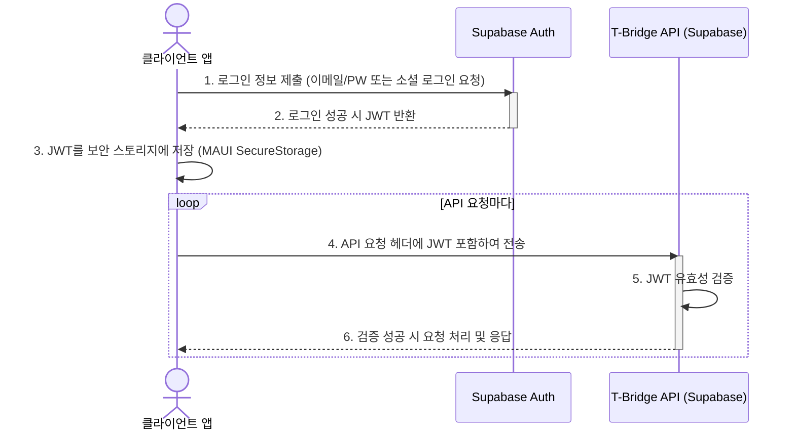

## T-Bridge 인증 및 보안 설계 방안

본 문서는 T-Bridge 서비스의 사용자 데이터와 시스템 리소스를 안전하게 보호하기 위한 인증(Authentication) 및 인가(Authorization), 그리고 전반적인 보안 강화 방안을 정의합니다.

### 1. 인증 (Authentication)

인증은 사용자가 누구인지 확인하는 과정입니다. T-Bridge는 Supabase의 내장 인증 서비스인 `Supabase Auth`를 사용하여 강력하고 유연한 인증 체계를 구축합니다.

- **인증 서비스**: **Supabase Auth**
- **인증 방식**: **JWT (JSON Web Token) 기반 토큰 인증**
- **로그인 옵션**:
    - 이메일 / 비밀번호
    - 소셜 로그인 (카카오, 네이버, 애플 등)

#### 인증 처리 절차



**절차 설명**:
1.  **로그인**: 클라이언트(모바일 앱, 웹 포털)에서 사용자가 이메일/비밀번호 입력 또는 소셜 로그인 버튼을 클릭하여 `Supabase Auth`에 인증을 요청합니다.
2.  **토큰 발급**: 인증이 성공하면, `Supabase Auth`는 해당 사용자에 대한 JWT를 생성하여 클라이언트에 반환합니다.
3.  **토큰 저장**: 클라이언트는 발급받은 JWT를 안전한 곳에 저장합니다. 모바일 앱의 경우, `Microsoft.Maui.Storage.SecureStorage`를 사용합니다.
4.  **API 요청**: 이후 모든 백엔드 API 요청 시, 클라이언트는 HTTP `Authorization` 헤더에 `Bearer <JWT>` 형태로 토큰을 포함하여 전송합니다.
5.  **요청 처리**: 백엔드(Supabase)는 API 요청을 수신할 때마다 JWT의 서명을 확인하여 유효성을 검증하고, 토큰에 명시된 사용자(subject)의 권한으로 요청을 처리합니다.

### 2. 인가 (Authorization)

인가는 인증된 사용자가 특정 리소스에 접근하거나 특정 작업을 수행할 수 있는지 확인하는 과정입니다. T-Bridge는 PostgreSQL의 강력한 기능인 **행 수준 보안(Row Level Security, RLS)**을 인가 모델의 핵심 기반으로 사용합니다.

- **핵심 인가 모델**: **행 수준 보안 (RLS)**
    - 애플리케이션 코드 레벨에서 권한을 확인하는 대신, 데이터베이스 레벨에서 데이터 접근을 직접 통제합니다.
    - 모든 `SELECT`, `INSERT`, `UPDATE`, `DELETE` 쿼리는 사전에 정의된 RLS 정책에 따라 자동으로 필터링됩니다.
    - 이는 코드 실수를 통한 데이터 노출 위험을 원천적으로 차단하는 매우 강력한 보안 모델입니다.

- **역할 기반 접근 제어 (RBAC)**:
    - `profiles` 테이블의 `role` 컬럼을 통해 사용자의 역할을 정의합니다.
        - **`user`**: 일반 사용자. 자신의 정보와 활동에만 접근 가능.
        - **`owner`**: 사업주. 자신과 관련된 판매점, 견적, 채팅 등에만 접근 가능.
        - **`admin`**: 최고 관리자. 플랫폼의 모든 데이터에 접근 가능.
    - RLS 정책은 `public.get_my_role()`과 같은 함수를 사용하여 현재 사용자의 역할을 확인하고, 역할에 따라 접근 권한을 부여합니다. (예: `USING (public.get_my_role() = 'admin')`)

- **데이터 소유권 기반 접근 제어**:
    - RLS 정책 내에서 Supabase의 내장 함수인 `auth.uid()`를 사용하여 현재 인증된 사용자의 UUID를 가져옵니다.
    - 이 ID를 테이블의 소유자 정보(예: `quote_requests.user_id`)와 비교하여, 사용자가 자신이 소유한 데이터에만 접근할 수 있도록 강제합니다. (예: `USING (auth.uid() = user_id)`)

### 3. 보안 강화 방안

- **데이터 암호화 (Data Encryption)**:
    - **전송 중 암호화 (In-Transit)**: 클라이언트와 Supabase 백엔드 간의 모든 통신은 **HTTPS/TLS**로 암호화되어 중간자 공격(Man-in-the-middle attack)으로부터 안전하게 보호됩니다.
    - **저장 시 암호화 (At-Rest)**: Supabase는 기본적으로 데이터베이스, 스토리지 등 모든 데이터를 디스크에 저장할 때 암호화합니다. 또한, `Supabase Auth`는 사용자 비밀번호를 직접 저장하지 않고, **해시(hash)하여 저장**하므로 원본 비밀번호 유출이 불가능합니다.

- **API 보안 (API Security)**:
    - **API Rate Limiting**: Supabase는 인증 및 API 엔드포인트에 대한 기본 속도 제한(Rate Limiting) 및 남용 방지 기능을 제공하여 Brute-force 공격과 같은 자동화된 공격을 방어합니다.
    - **익명 접근 최소화**: '익명 견적 요청' 기능은 읽기 전용으로 제한되며, 데이터를 생성하거나 수정하는 모든 API 엔드포인트는 RLS 정책에 따라 반드시 인증된 사용자만 접근할 수 있도록 설정합니다.

- **민감 정보 관리 (Sensitive Information Management)**:
    - Supabase URL, `anon` key, `service_role` key 등 민감한 자격 증명은 소스 코드에 절대 하드코딩하지 않습니다.
    - **CI/CD 환경**: **GitHub Actions Secrets**를 사용하여 안전하게 관리합니다.
    - **애플리케이션 환경**: 배포 대상 환경(예: Azure App Service)의 **환경 변수(Environment Variables)**를 통해 애플리케이션에 주입합니다.

### 4. 테이블별 RLS 정책 정의

#### `devices` 테이블
- **목표**: 최고관리자(`admin`)는 모든 작업을 수행할 수 있고, 그 외 사용자(판매점 포함)는 조회만 가능하다.
- **정책**:
    1.  **조회(SELECT) 정책**: 인증된 모든 사용자는 `deleted_at`이 `NULL`인 단말기 정보를 조회할 수 있다.
    2.  **조작(ALL) 정책**: `admin` 역할을 가진 사용자는 모든 작업(INSERT, UPDATE, DELETE)을 수행할 수 있다.

- **구현 (SQL)**:
    ```sql
    -- 1. devices 테이블에 RLS 활성화
    ALTER TABLE public.devices ENABLE ROW LEVEL SECURITY;

    -- 2. admin 사용자의 모든 권한 허용 정책
    CREATE POLICY "Admin full access on devices"
    ON public.devices
    FOR ALL
    USING (public.get_my_role() = 'admin')
    WITH CHECK (public.get_my_role() = 'admin');

    -- 3. 인증된 사용자의 읽기 전용 허용 정책
    CREATE POLICY "Authenticated users can read devices"
    ON public.devices
    FOR SELECT
    USING (
      auth.role() = 'authenticated'
      AND deleted_at IS NULL
    );
    ```

#### `internet_products` 테이블 (신규)
- **목표**: `devices` 테이블과 동일하게, 최고관리자(`admin`)만 모든 작업을 수행하고 다른 사용자는 조회만 가능하다.
- **정책**:
    1.  **조회(SELECT) 정책**: 인증된 모든 사용자는 `deleted_at`이 `NULL`인 인터넷 상품 정보를 조회할 수 있다.
    2.  **조작(ALL) 정책**: `admin` 역할을 가진 사용자는 모든 작업(INSERT, UPDATE, DELETE)을 수행할 수 있다.

- **구현 (SQL)**:
    ```sql
    -- 1. internet_products 테이블에 RLS 활성화
    ALTER TABLE public.internet_products ENABLE ROW LEVEL SECURITY;

    -- 2. admin 사용자의 모든 권한 허용 정책
    CREATE POLICY "Admin full access on internet_products"
    ON public.internet_products
    FOR ALL
    USING (public.get_my_role() = 'admin')
    WITH CHECK (public.get_my_role() = 'admin');

    -- 3. 인증된 사용자의 읽기 전용 허용 정책
    CREATE POLICY "Authenticated users can read internet_products"
    ON public.internet_products
    FOR SELECT
    USING (
      auth.role() = 'authenticated'
      AND deleted_at IS NULL
    );
    ```