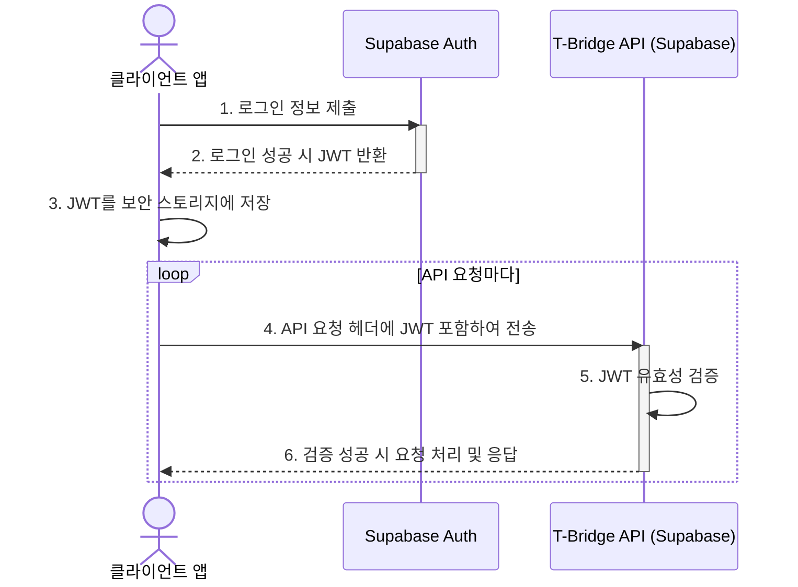

## T-Bridge 인증 및 보안 설계 방안

본 문서는 T-Bridge 서비스의 사용자 데이터와 시스템 리소스를 안전하게 보호하기 위한 인증(Authentication) 및 인가(Authorization), 그리고 전반적인 보안 강화 방안을 정의합니다.

### 1. 인증 (Authentication)

인증은 사용자가 누구인지 확인하는 과정입니다. T-Bridge는 Supabase의 내장 인증 서비스인 `Supabase Auth`를 사용하여 강력하고 유연한 인증 체계를 구축합니다.

- **인증 서비스**: **Supabase Auth**
- **인증 방식**: **JWT (JSON Web Token) 기반 토큰 인증**
- **로그인 옵션**: 이메일/비밀번호, 소셜 로그인 (카카오, 네이버, 애플 등)

#### 인증 처리 절차

### 2. 인가 (Authorization)

- **핵심 인가 모델**: **행 수준 보안 (Row Level Security, RLS)**
- **역할 기반 접근 제어 (RBAC)**: `profiles` 테이블의 `role` 컬럼('user', 'owner', 'admin')을 기반으로 RLS 정책을 적용합니다.
- **데이터 소유권 기반 접근 제어**: `auth.uid()` 함수를 사용하여 현재 사용자가 자신이 소유한 데이터에만 접근할 수 있도록 강제합니다.

### 3. 세션 분리 (User-App / Biz-App)

`user-app`과 `biz-app`은 동일한 Supabase 프로젝트를 공유하므로, 클라이언트 단에서 로그인 세션을 분리해야 합니다. 이는 **`storageKey` 옵션**을 통해 구현합니다.

- **`user-app` (TBridge.Maui) 설정**:
    - Supabase 클라이언트 초기화 시 `storageKey: 'user-app-auth-token'` 옵션을 추가합니다.
- **`biz-app` (TBridge.Web) 설정**:
    - Supabase 클라이언트 초기화 시 `storageKey: 'biz-app-auth-token'` 옵션을 추가합니다.

이 설정을 통해 각 앱은 브라우저의 `localStorage` 또는 앱의 보안 스토리지에 별도의 키로 인증 토큰을 저장하게 되어, 한쪽의 로그인 상태가 다른 쪽에 영향을 주지 않습니다.

### 4. 보안 강화 방안

- **데이터 암호화**: 모든 통신은 HTTPS/TLS로 암호화되며, 저장된 데이터와 비밀번호는 Supabase에 의해 암호화/해시 처리됩니다.
- **API 보안**: Supabase의 기본 Rate Limiting 및 남용 방지 기능을 활용합니다.
- **민감 정보 관리**: Supabase 관련 키는 GitHub Actions Secrets 및 애플리케이션 환경 변수를 통해 안전하게 관리합니다.