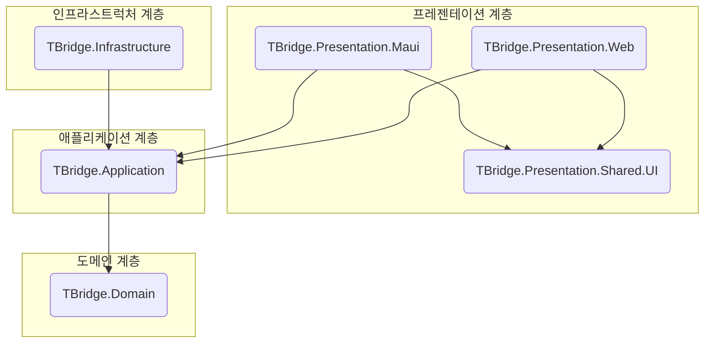

## T-Bridge C#/.NET 8 코딩 컨벤션 및 아키텍처 가이드

본 문서는 T-Bridge 프로젝트의 코드 품질, 일관성, 확장성을 보장하기 위한 표준 코딩 컨벤션과 솔루션 아키텍처를 정의합니다. 모든 개발자는 본 가이드라인을 숙지하고 준수해야 합니다.

---

### 1. C# 코딩 컨벤션

#### 1.1. 네이밍 규칙 (Naming Rules)

| 구분                          | 형식                       | 예시                                  |
| :-------------------------- | :----------------------- | :---------------------------------- |
| **클래스, 레코드, 인터페이스, Enum**   | `PascalCase`             | `QuoteRequest`, `IQuoteService`     |
| - 인터페이스                     | `I` 접두사를 붙인 `PascalCase` | `IQuoteService`                     |
| **메서드 (동기/비동기)**            | `PascalCase`             | `GetQuotes()`, `CreateQuoteAsync()` |
| - 비동기 메서드                   | `Async` 접미사 추가           | `CreateQuoteAsync()`                |
| **속성(Property), 상수(const)** | `PascalCase`             | `RequestDetails`, `DefaultTimeout`  |
| **매개변수(Parameter), 지역 변수**  | `camelCase`              | `quoteRequest`, `userId`            |
| **private 필드**              | `_` 접두사를 붙인 `camelCase`  | `_quoteRepository`                  |

#### 1.2. 서식 및 들여쓰기 (Formatting & Indentation)

-   **들여쓰기**: 4개의 공백(Space)을 사용합니다.
-   **괄호 `{}`**: `if`, `for`, `foreach`, `while` 등 모든 제어문에서 중괄호를 생략하지 않으며, 여는 괄호 `{`는 다음 줄에 작성합니다.
-   **EditorConfig**: 프로젝트 루트에 `.editorconfig` 파일을 포함하여 모든 개발자가 동일한 서식 규칙을 유지하도록 강제합니다.

#### 1.3. 주석 스타일 (Commenting Style)

-   **XML 문서 주석 `///`**: 외부에 노출되는 모든 `public` 클래스, 메서드, 속성에는 반드시 XML 주석을 작성하여 기능, 매개변수, 반환 값을 명확히 설명합니다.
-   **인라인 주석 `//`**: 복잡한 비즈니스 로직이나 명확한 설명이 필요한 알고리즘 등, 코드만으로 의도를 파악하기 어려운 부분에 간결하게 사용합니다. 불필요하거나 자명한 주석은 지양합니다.

### 2. 솔루션 아키텍처

T-Bridge는 DDD(도메인 주도 설계)를 적용한 **클린 아키텍처(Clean Architecture)**를 기반으로 합니다. 이는 계층 간의 의존성을 명확히 하고, 비즈니스 로직을 외부 환경(UI, DB, API 등)의 변화로부터 보호하여 유지보수성과 테스트 용이성을 극대화합니다.

#### 2.1. 아키텍처 다이어그램

**핵심 의존성 규칙**: 의존성은 항상 외부 계층에서 내부 계층으로만 향합니다. `Domain` 계층은 프로젝트의 심장부로, 다른 어떤 계층에도 의존하지 않습니다.

#### 2.2. 프로젝트 구조 및 역할

| 프로젝트 명 | 역할 및 책임 | 주요 내용 | 참조하는 계층 |
| :--- | :--- | :--- | :--- |
| **`TBridge.Domain`** | **도메인 계층**: 핵심 비즈니스 규칙과 데이터를 포함하는 영역. | - 애그리거트 루트, 엔티티, 값 객체 - 리포지토리 인터페이스 (`IQuoteRepository`) | 없음 |
| **`TBridge.Application`** | **애플리케이션 계층**: 사용 사례(Use Case)를 구현하고 도메인 객체를 오케스트레이션. | - 애플리케이션 서비스 (`QuoteService`) - DTO(Data Transfer Objects) - 인터페이스 (`IQuoteService`) | `TBridge.Domain` |
| **`TBridge.Infrastructure`** | **인프라 계층**: 외부 기술에 대한 실제 구현을 포함. | - 리포지토리 구현체 (`SupabaseQuoteRepository`) - Supabase 클라이언트, 외부 API 클라이언트 | `TBridge.Application` |
| **`TBridge.Presentation.Maui`** | **프레젠테이션 계층**: 최종 사용자용 모바일 앱. | - Blazor 페이지, 컴포넌트, ViewModel - `MauiProgram.cs` (DI 설정) | `TBridge.Application`, `TBridge.Infrastructure` |
| **`TBridge.Presentation.Web`** | **프레젠테이션 계층**: 관리자/사업주용 웹 포털. | - Blazor 페이지, 컴포넌트, ViewModel - `Program.cs` (DI 설정) | `TBridge.Application`, `TBridge.Infrastructure` |
| **`TBridge.Presentation.Shared.UI`** | **공유 프레젠테이션**: 여러 UI 프로젝트에서 공유되는 컴포넌트. | - 공통 Razor 컴포넌트 (RCL) | 없음 |

#### 2.3. SOLID 원칙과 아키텍처

클린 아키텍처는 SOLID 원칙을 자연스럽게 준수하도록 유도합니다.

-   **단일 책임 원칙 (SRP)**: 각 계층과 클래스는 명확히 분리된 책임을 가집니다. (예: `Application`은 오케스트레이션, `Domain`은 핵심 규칙, `Infrastructure`는 데이터 접근)
-   **개방-폐쇄 원칙 (OCP)**: DB를 Supabase에서 다른 것으로 변경해야 할 경우, `Domain`과 `Application` 계층의 변경 없이 `Infrastructure` 계층에 새로운 구현체만 추가하면 됩니다.
-   **의존관계 역전 원칙 (DIP)**: `Application` 계층이 `Infrastructure`의 구체적인 구현이 아닌 `Domain` 계층의 리포지토리 인터페이스에 의존함으로써 의존성 규칙을 강제합니다. 이는 DI를 통해 실현됩니다.